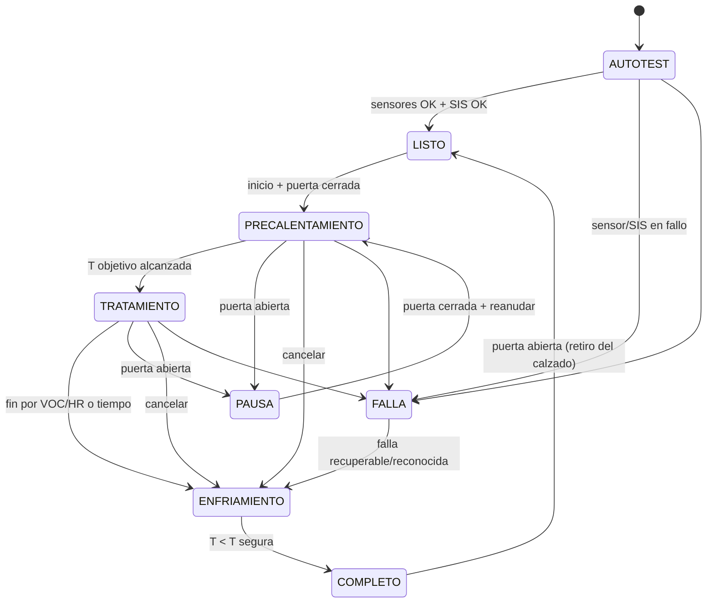

# Máquina de estados del ciclo (MCU 1)

| Estado | PTC | Ventilador recámara | Notas |
|---|---|---|---|
| AUTOTEST | Off | Off | Verifica lecturas, enlace con SIS, retroalimentación del permiso |
| LISTO | Off | Off | Espera usuario |
| PRECALENTAMIENTO | Control | On | Rampa limitada |
| TRATAMIENTO | Control | On | Mantiene T; vigila VOC y HR |
| PAUSA | Off | On (opcional) | Puerta abierta |
| ENFRIAMIENTO | Off | On | Hasta T por debajo de umbral seguro |
| COMPLETO | Off | Off | Aviso al usuario |
| FALLA | Off | On | Muestra causa; el SIS puede estar disparado |

Puerta (regla de inicio y de pausa):
- **Inicio**: sólo desde LISTO con la puerta cerrada, el autotest correcto y el SIS en OK. Con la puerta abierta, la solicitud se rechaza y el HMI muestra "Cierra la puerta".
- **Puerta abierta durante el ciclo**: el SIS inhibe el PTC al instante (no enclava) y la Mega pasa a PAUSA.
- **Puerta cerrada de nuevo**: el PTC **no** vuelve solo. El usuario debe pulsar "Reanudar" en el HMI. Si la pausa supera **5 minutos** (decisión del usuario), el ciclo se cancela y pasa a ENFRIAMIENTO; hay que volver a elegir tipo, intensidad y duración.

Temporizadores:
- **Precalentamiento**: tiempo límite [VERIFICAR]; si no se alcanza la temperatura objetivo, pasa a FALLA.
- **Tratamiento**: cuenta la duración elegida (Corta/Media/Larga) sólo mientras la temperatura esté dentro de banda.
- Tope global de 120 min (también en el SIS).
- Al volver la energía tras un corte, el estado inicial es AUTOTEST → LISTO; nunca retoma un ciclo.

Esta máquina es de **proceso**. El SIS tiene la suya ([firmware-sis.md](firmware-sis.md)) y no depende de ésta.
