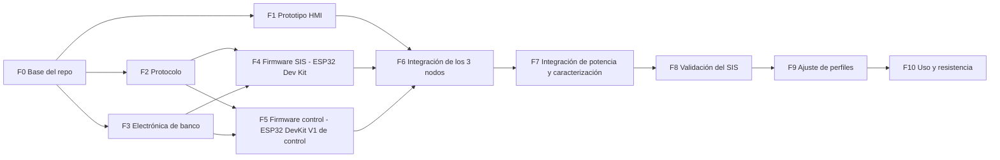

# Plan maestro de implementación — QuitaSicote3000

Versión 7 · 2026-10-06 · Electrónica y firmware de todo el sistema.

---

## 0. Cómo leer este documento (personas y agentes de IA)

### 0.1 Propósito
Este documento es la **referencia principal** para implementar el sistema completo: electrónica, firmware de los tres nodos, pruebas y orden de trabajo. Está escrito para que otra persona u otro agente de IA pueda continuar el proyecto **sin el historial de conversación**.

### 0.2 Regla de máxima prioridad [CONFIRMADO]

> **El control y el SIS corren en dos ESP32 DevKit V1 distintos (uno para cada uno). Esta separación se mantiene estrictamente en todo el proyecto** ([ADR-0012](decisiones/ADR-0012-regla-mega-control-nano-sis.md)).

- Todo lo que sea **control** (ciclo, perfiles, regulación, ventiladores, sensores de proceso) corre en el **ESP32 DevKit V1 de control**.
- Todo lo que sea **seguridad** (funciones SIF, permiso del PTC, vetos, forzados, enclavamientos) corre en el **ESP32 Dev Kit**.
- Si una salida necesita a la vez la orden del control y una condición de seguridad, se combina **por hardware** con **contactos de módulos de relé** (NC en paralelo = AND para apagar; NA en paralelo = OR para encender). **Nunca** se mueve una función de un controlador al otro.
- El HMI (ESP32-32E) no hace ni control ni seguridad.

**Preferencias de hardware [CONFIRMADO]** ([ADR-0013](decisiones/ADR-0013-solo-modulos-y-dispositivos.md)):
- Sólo **módulos o dispositivos**: nada de resistencias, condensadores, diodos, transistores ni circuitos integrados sueltos.
- **Sin** módulos optoacopladores ni convertidores de nivel lógico.
- **Sin** fusibles ni caja de fusibles.

### 0.3 Etiquetas de estado

| Etiqueta | Significado | ¿Se puede cambiar sin consultar? |
|---|---|---|
| **[CONFIRMADO]** | Dato o decisión dada explícitamente por el usuario | **No** |
| **[DECIDIDO]** | Propuesta aceptada por el usuario (ADR aceptado) | No, salvo error técnico demostrado |
| **[PROPUESTA]** | Sugerencia técnica no confirmada por el usuario | Sí, justificándolo |
| **[POR MEDIR]** | Valor que debe salir de un ensayo; el número escrito es provisional | Sí, con el resultado del ensayo |
| **[VERIFICAR]** | Dato externo (hoja de datos, placa) aún no comprobado | Sí, al comprobarlo |
| **[ABIERTO]** | Falta una decisión del usuario | No: preguntar |

### 0.4 Reglas para quien modifique el proyecto
1. La regla y las preferencias de §0.2 están por encima de cualquier otra consideración.
2. Ante un conflicto entre este plan y otro documento del repo, **no elijas en silencio**: corrige el que esté mal y anótalo en el registro de cambios (§15).
3. El SIS no acepta umbrales ni órdenes que relajen la seguridad por la comunicación: **lo que recibe sólo puede restringir**.
4. El HMI **no decide nada**: muestra lo que envía el control y hace solicitudes. Nunca envía temperaturas ni minutos.
5. Los nombres de constantes de la §12 son los que deben usarse en el código.
6. Documentación y comentarios en **español**; identificadores de código en **inglés**.
7. Al terminar una fase, actualiza su estado en la §10 y el registro de cambios.

### 0.5 Documentos relacionados
| Documento | Contenido |
|---|---|
| [pinout/](pinout/README.md) | **Pinout de cada controlador**: única fuente de números de pin |
| [requisitos.md](requisitos.md) | Requisitos RF/RS/RD |
| [arquitectura.md](arquitectura.md) | Resumen de nodos y responsabilidades |
| [maquina-de-estados.md](maquina-de-estados.md) | Ciclo del control (resumen) |
| [perfiles-de-tratamiento.md](perfiles-de-tratamiento.md) | Calzado × intensidad × duración |
| [comunicacion.md](comunicacion.md) | Enlaces (resumen; el detalle de bytes está en §6) |
| [seguridad-sis.md](seguridad-sis.md) | SIF y pruebas V-xx (resumen) |
| [decisiones/](decisiones/README.md) | ADRs |
| [../firmware/hmi/PLAN.md](../firmware/hmi/PLAN.md) | Plan detallado de la interfaz LVGL |

---

## 1. Qué es el sistema

Equipo **doméstico** [CONFIRMADO] que elimina el mal olor del calzado haciendo circular aire caliente por una recámara cerrada. El usuario elige tipo de calzado, intensidad y duración en una pantalla táctil; el equipo calienta con una resistencia PTC, ventila y enfría.

### 1.1 Nodos [CONFIRMADO]

| Nodo | Placa | Función |
|---|---|---|
| **Control** | **ESP32 DevKit V1** n.º 1 (DOIT, ESP32-WROOM-32, 30 pines) | Ciclo de tratamiento, sensores de proceso, SSR del PTC y ventiladores |
| **SIS** | **ESP32 DevKit V1** n.º 2 (mismo modelo, placa distinta) | Seguridad independiente: relé de permiso del PTC, relés de veto y forzado de ventiladores, enclavamientos |
| **HMI** | ESP32-32E con pantalla 3.2" (E32R32P) | Interfaz táctil; **sólo comunicación**, sin entradas ni salidas de proceso |

Los tres trabajan a **3,3 V**: se conectan entre sí directamente.

### 1.2 Capas de protección
```
Capa 3  Termostato bimetálico 80 °C en serie con el PTC   → hardware puro
Capa 2  SIS (ESP32 Dev Kit): su termopar y relé de permiso → software mínimo e independiente
Capa 1  Control (ESP32 DevKit V1 de control): límites de proceso sobre el SSR → lógica de proceso
```
Cada capa puede apagar el PTC **por sí sola**: TH1 abre el circuito, el SIS abre RL1, el control apaga SSR1.

### 1.3 Datos confirmados por el usuario (procedencia)
- **Control y SIS en dos ESP32 DevKit V1 separados, estrictamente** (máxima prioridad). Antes fueron Arduino Mega y Nano, y después ESP32-S3 y ESP32 Dev Kit: se cambiaron.
- Producto doméstico; se controla **sólo desde la pantalla**; **no hay botón físico de paro**.
- La pantalla ESP32-32E sólo se comunica.
- 3 termopares tipo K con 3 MAX6675; SHT31 (T/HR); SGP40 (VOC).
- 2 SSR de DC: uno para el PTC y otro para el ventilador de circulación.
- PTC de **100 W a 12 V** con ventilador propio; ese ventilador tiene alimentación separada y lo conmuta un **módulo de relé de 12 V** (configurable; se eligió **NC + disparo por nivel alto**).
- **Otro módulo de relé en serie con el PTC** como permiso del SIS.
- Ventilador de la cámara de circuitos conectado **directo a 12 V**.
- Todos los ventiladores son de **12 V y 2 cables** (sin tacómetro).
- **Un solo termostato bimetálico de 2 cables, 80 °C, rearme automático.** "No hay ninguna situación donde deba alcanzarse esa temperatura a menos que haya fuego."
- **Sólo módulos o dispositivos**; **sin** optoacopladores, **sin** convertidores de nivel, **sin** fusibles ni caja de fusibles, sin fusible térmico.
- **Dos reguladores de 5 V** (uno para el control y otro para el SIS).
- Limit switch de puerta: se usan **ambos contactos, NA y NC**.
- Fuente externa de **12 V / 20 A**. Corriente de arranque del PTC **desconocida**.
- Inicio de ciclo **sólo con la puerta cerrada**. Pausa máxima **5 min**.
- Enclavado persistente y **bloqueo tras 2 eventos** del termostato (reformulación pendiente, A-11).
- **4 tipos de calzado**, intensidad y duración con **3 opciones** cada una, sin valores ni porcentajes visibles.
- Pantalla en **horizontal**.

---

## 2. Estado actual (2026-10-06)

| Área | Estado |
|---|---|
| Documentación de arquitectura | Hecha (este plan + `docs/`) |
| Código | **Primera versión escrita (2026-10-06)**: protocolo, SIS, control y HMI compilan; sin probar en hardware |
| Plan del HMI | Pantallas escritas con LVGL 9; faltan las fuentes con acentos y la prueba en la placa |
| Hardware | Faltan, además de lo de §1.3: los dos ESP32 DevKit V1, RL1 (módulo de relé de 30 A), RM1 (módulo de 2 relés), REG_A, REG_B |
| Ensayos | Ninguno |

---

## 3. Requisitos clave (resumen)

Detalle en [requisitos.md](requisitos.md). Los que más condicionan el diseño:

- **RS-01** El PTC nunca se energiza con la puerta abierta.
- **RS-02** El PTC nunca supera el límite de seguridad aunque falle el control.
- **RS-03** El PTC nunca queda energizado sin flujo de aire.
- **RS-04** Pérdida de alimentación, de comunicación o de sensor ⇒ calentador apagado.
- **RS-05** Un fallo del control no puede desactivar al SIS.
- **RF-03** Inicio sólo con la puerta cerrada (HMI, control y SIS lo comprueban).
- **RD-03** Si el control pierde al HMI más de 10 s durante un ciclo, cancela y enfría.
- **RD-04** Tras un corte de energía, el ciclo no se reanuda.

---

## 4. Decisiones

### 4.1 Tomadas

| ID | Decisión | Estado |
|---|---|---|
| — | **Control y SIS en dos ESP32 DevKit V1 separados, estrictamente** | [CONFIRMADO] ([ADR-0012](decisiones/ADR-0012-regla-mega-control-nano-sis.md), [ADR-0002](decisiones/ADR-0002-mcu-del-sis.md)) |
| A-1 | El SIS corta el PTC con un **módulo de relé (RL1) en serie** | [DECIDIDO] ([ADR-0010](decisiones/ADR-0010-permiso-ptc-modulo-rele.md)) |
| A-2 | **Sólo módulos o dispositivos**; sin optoacopladores ni convertidores de nivel | [CONFIRMADO] ([ADR-0013](decisiones/ADR-0013-solo-modulos-y-dispositivos.md)) |
| A-3 | **Dos reguladores de 5 V** independientes | [CONFIRMADO] |
| A-9 | Enlaces directos a 3,3 V entre los tres ESP32 | [DECIDIDO] (consecuencia del cambio de controladores) |
| A-13 | Control y SIS: **ESP32 DevKit V1** (uno cada uno) | [CONFIRMADO] 2026-10-06 |
| A-10 | **Sin fusibles ni caja de fusibles**: la única protección contra cortocircuitos es la de la propia fuente | [CONFIRMADO]; riesgo aceptado (§13) |

### 4.2 Abiertas

| ID | Pregunta | Opciones | Recomendación | Bloquea |
|---|---|---|---|---|
| **A-11** | **Dónde cablear el termostato bimetálico** (TH1, 2 cables) | **T1**: en serie con los 12 V del PTC (barrera independiente de todo, pero el SIS no puede leerlo). **T2**: en serie con la señal de 3,3 V del SIS hacia RL1, leído por un pin del SIS (se puede leer y enclavar, pero si RL1 se suelda el termostato ya no corta). Detalle en [ADR-0008](decisiones/ADR-0008-termostato-rearme-automatico.md) | **T1**, con el bloqueo tras 2 eventos aplicado a los eventos térmicos que el SIS detecta (SIF-01, SIF-03, SIF-08) | F3, F4 |
| **A-12** | ¿Recuperar la lectura de los nodos de 12 V con un **módulo sensor de voltaje** (0–25 V, salida analógica)? Permitiría leer el termostato, el contacto de RL1, un SSR1 en corto y la tensión del ventilador del PTC | Sí / no | Opcional; recomendable si se acepta ese tipo de módulo | F3 |
| **A-4** | Si el SIS deja de recibir al control con el permiso concedido, ¿disparo enclavado o sólo retirar el permiso? | — | Disparo enclavado | F4 |
| **A-5** | Procedimiento de servicio tras el bloqueo | Ver §7.9 | Comando por USB del control + secuencia de puerta | F4 |
| **A-6** | ¿VOC/HR como criterio de fin anticipado? | Sí / no / sólo informativo | Sólo informativo hasta tener datos | F9 |
| **A-7** | Registro de ciclos | CSV por USB del control / SD del HMI | CSV por USB desde el principio; SD después | F5 |
| **A-8** | Nombres de los 4 calzados | — | Cuero, Deportivo, Bota, Sintético | F1 |

---

## 5. Electrónica

### 5.0 Componentes y designadores

| Ref. | Componente | Estado |
|---|---|---|
| PSU | Fuente externa 12 V / 20 A | [CONFIRMADO] |
| J1 | Conector de entrada de 12 V con polaridad (p. ej. XT60): protege contra polaridad inversa | [PROPUESTA] |
| TH1 | Termostato bimetálico 80 °C, 2 cables, NC, rearme automático | [CONFIRMADO]; cableado [ABIERTO A-11] |
| **RL1** | **Módulo de relé de 12 V, permiso del PTC**: contacto **NA**, disparo **ALTO** compatible con 3,3 V, contacto **≥ 30 A en DC**. Lo maneja el SIS | Tipo [DECIDIDO]; especificación [PROPUESTA] |
| SSR1 | SSR DC-DC (MOSFET) para el PTC. Lo maneja el control | [CONFIRMADO]; especificación [PROPUESTA] |
| SSR2 | SSR DC-DC para el ventilador de circulación. Lo maneja el control | [CONFIRMADO] |
| RL2 | Módulo de relé de 12 V del ventilador del PTC: contacto **NC**, disparo **ALTO**. Lo maneja el control | [CONFIRMADO] |
| **RM1** | **Módulo de 2 relés** (disparo **ALTO** compatible con 3,3 V) para el SIS: **RL3** = veto del apagado de FAN_P (contacto **NC**, en paralelo con RL2); **RL4** = forzado de FAN_C (contacto **NA**, en paralelo con SSR2) | [PROPUESTA] |
| PTC | Calefactor PTC 100 W / 12 V | [CONFIRMADO] |
| FAN_P | Ventilador del PTC (12 V, 2 cables) | [CONFIRMADO] |
| FAN_C | Ventilador de circulación (12 V, 2 cables) | [CONFIRMADO] |
| FAN_B | Ventilador de la cámara de circuitos (12 V, 2 cables) | [CONFIRMADO] |
| REG_A | Módulo regulador conmutado (buck) 12 → 5 V, ≥ 2 A: lado control (ESP32 DevKit V1 de control + HMI) | [CONFIRMADO]; especificación [PROPUESTA] |
| REG_B | Módulo regulador conmutado 12 → 5 V, ≥ 1 A: lado SIS | [CONFIRMADO]; especificación [PROPUESTA] |
| SW1 | Limit switch de puerta SPDT (COM, NA, NC) | [CONFIRMADO] |
| TC1–TC3 + M1–M3 | Termopar K + módulo MAX6675 (alimentado a 3,3 V) | [CONFIRMADO] |
| S1 | Módulo SHT31 (I2C 0x44), alimentado a 3,3 V | [CONFIRMADO] |
| S2 | Módulo SGP40 (I2C 0x59), alimentado a 3,3 V | [CONFIRMADO] |
| MCU_C | ESP32 DevKit V1 n.º 1 (control) | [CONFIRMADO] |
| MCU_S | ESP32 DevKit V1 n.º 2 (SIS) | [CONFIRMADO] |
| HMI | Placa ESP32-32E 3.2" | [CONFIRMADO] |

### 5.1 Presupuesto de corriente (12 V)

| Carga | Corriente | Estado |
|---|---|---|
| PTC en régimen | ≈ 8,3 A | Calculado (100 W / 12 V) |
| PTC en el arranque | Mayor: un PTC frío tiene menos resistencia | [POR MEDIR] F7 |
| FAN_P, FAN_C, FAN_B | ≈ 0,1–0,5 A cada uno | [POR MEDIR] |
| Bobinas de RL1, RL2, RL3, RL4 | ≈ 0,07–0,2 A cada una | [VERIFICAR] modelo |
| Lógica a 5 V (ESP32 DevKit V1 de control, ESP32, HMI con retroiluminación, sensores) | ≈ 0,7 A a 5 V ⇒ ≈ 0,35 A a 12 V | Estimado (radios apagadas) |
| **Total** | **≈ 10 A en régimen** | La fuente de 20 A tiene margen |

### 5.2 Distribución de potencia

Con la opción **T1** de A-11 (termostato en la línea del PTC):

```
PSU 12 V ─ J1 ─┬─ TH1 ── RL1 (COM→NA) ── PTC(+)   PTC(−) ── SSR1 salida(+)  SSR1 salida(−) ── GND
               │
               ├─ RL2 (COM→NC) ──┐
               ├─ RL3 (COM→NC) ──┴── FAN_P(+)     FAN_P(−) ── GND        (NC en paralelo = AND para apagar)
               ├─ FAN_C(+)   FAN_C(−) ─┬─ SSR2 salida(+)  SSR2 salida(−) ── GND
               │                       └─ RL4 (COM→NA) ── GND            (NA en paralelo = OR para encender)
               ├─ FAN_B(+)   FAN_B(−) ── GND                             (siempre encendido)
               ├─ VCC de RL1, RL2 y RM1 (bobinas de 12 V)
               │
               ├─ REG_A ── 5V_A ──► ESP32 DevKit V1 de control (pin 5V), HMI (USB-C)
               └─ REG_B ── 5V_B ──► ESP32 Dev Kit (pin 5V/VIN)

3V3 del ESP32 DevKit V1 de control ──► M1, M2 (MAX6675), S1 (SHT31), S2 (SGP40)
3V3 del ESP32 Dev Kit ──► M3 (MAX6675)
```

Con la opción **T2**, TH1 sale de la línea del PTC (12 V directo a RL1) y pasa a la señal: `pin de permiso del SIS → TH1 → RL1.IN`, con un segundo pin del SIS leyendo el lado de RL1.IN.

Notas:
- **SSR1 y SSR2 en el lado bajo** (entre la carga y GND) [PROPUESTA], la configuración habitual de los SSR DC-DC [VERIFICAR con el modelo].
- **FAN_P no pasa por TH1, RL1 ni SSR1**: sigue funcionando cuando la rama del PTC está cortada.
- **Reguladores al pin 5V** de cada placa; el regulador de 3,3 V de la propia placa alimenta el ESP32 y los sensores.
- **Programación por USB**: con el regulador conectado al pin 5V, comprobar si la placa tiene un diodo entre el USB y el pin 5V [VERIFICAR]. Si no lo tiene, **no conectar el USB a la vez** que el regulador.
- **Sensores a 3,3 V**: alimentarlos desde el pin 3V3 de su placa, para que sus señales sean de 3,3 V. **Ninguna entrada de un ESP32 tolera 5 V.**
- **Módulos de relé y SSR manejados con 3,3 V**: deben activarse de forma fiable con 3,3 V en la entrada (disparo ALTO) [VERIFICAR en F3]. **No usar módulos con disparo por nivel bajo** alimentados a 5 V: con 3,3 V en la entrada podrían quedar a medio activar.
- **Sin pull-downs** (ADR-0013): cada módulo de relé y cada SSR debe quedar **desactivado con la entrada al aire**, porque así queda mientras su controlador arranca. Se comprueba en F3; un módulo que no lo cumpla se cambia.
- **Sin fusibles** [CONFIRMADO]: el cable principal y la rama del PTC deben soportar la corriente a la que actúa la protección de la fuente (≈ 20–25 A): **12 AWG (4 mm²)**. Los cables finos de ventiladores y módulos no quedan protegidos ante un cortocircuito (riesgo aceptado, §13).

### 5.3 Rama del PTC

- **Orden (T1)**: PSU → TH1 → RL1 (contacto NA) → PTC → SSR1 → GND. Cualquiera de los tres que abra apaga el PTC.
- **RL1** [DECIDIDO]: módulo de relé con disparo ALTO manejado por el SIS; energizado = permitido. **El contacto debe soportar la corriente del PTC en DC**: los módulos comunes de 10 A (relé tipo SRD) **no sirven**; usar uno de **30 A** (relé tipo SLA) y comprobar su especificación en DC [VERIFICAR]. RL1 se cierra al empezar a calentar y se abre al terminar.
- **TH1 (T1)**: el contacto bimetálico debe soportar ≈ 8,3 A en DC [VERIFICAR: los datos suelen darse para CA].
- **SSR1**: DC-DC de salida MOSFET, especificado para **≥ 40 A** si es un modelo genérico (los "25DD" de bajo costo suelen soportar mucho menos de lo indicado), con disipador [PROPUESTA]. Entrada de 3–32 V DC: comprobar que activa con 3,3 V [VERIFICAR].
- **Conmutación lenta** del SSR1: ventana proporcional de 2 s con mínimo 100 ms encendido/apagado (§8.6).
- **Cableado**: 12 AWG (4 mm²); terminales y conectores de ≥ 25 A; retorno propio a la estrella de tierra.

### 5.4 Ventiladores

| Ventilador | Lo maneja el control (ESP32 DevKit V1 de control) | Intervención del SIS (ESP32 Dev Kit) | Combinación | Reposo / falla |
|---|---|---|---|---|
| FAN_P (PTC) | RL2, **ALTO = pedir apagado** | RL3, **ALTO = permitir apagado** | Contactos **NC en paralelo**: se apaga sólo si RL2 **y** RL3 están energizados | Cualquier controlador sin alimentación o arrancando ⇒ su relé sin energizar ⇒ **encendido** |
| FAN_C (circulación) | SSR2, ALTO = encender | RL4, **ALTO = forzar encendido** | Contacto NA de RL4 **en paralelo** con la salida de SSR2 | Sin señales ⇒ apagado |
| FAN_B (cámara de circuitos) | — | — | — | Siempre encendido (directo a 12 V) |

- Si cae REG_A (control apagado) **o** REG_B (SIS apagado), el ventilador del PTC sigue girando.
- No hay sensado de tensión ni de giro en ningún ventilador (2 cables, sin módulos de lectura de 12 V).
- **FAN_B** debe tomar aire del exterior, no de la recámara (caliente, húmeda y con vapores), con rejilla.

### 5.5 Lo que el SIS no puede medir (ADR-0013)

Sin módulos de lectura de 12 V, el SIS **no** ve: el termostato (con T1), el contacto real de RL1, un SSR1 en corto ni la tensión del ventilador del PTC. Se compensa con:
- **TC3** montado junto a TH1: SIF-01 (sobretemperatura), SIF-03 (subida brusca) y SIF-08 (calentamiento sin efecto).
- **El control**: ante sobretemperatura pasa a FALLA y retira `heat_request`, con lo que el SIS abre RL1.
- Opción A-12 (módulo sensor de voltaje) o T2 (termostato leído por el SIS) para recuperar parte de esas lecturas.

### 5.6 Sensores

| Sensor | Bus / dirección | Nodo | Montaje |
|---|---|---|---|
| TC1 + M1 | SPI | Control | Aire de la recámara, cerca del calzado. Variable de control |
| TC2 + M2 | SPI | Control | Aire a la salida del PTC (unos cm aguas abajo). Límite y diagnóstico de flujo |
| TC3 + M3 | SPI | SIS | Aire en el punto más caliente en caso de falla, **junto a TH1, sin tocar las aletas del PTC** [POR MEDIR en F7] |
| S1 SHT31 | I2C 0x44 | Control | Recámara, fuera del chorro directo del PTC |
| S2 SGP40 | I2C 0x59 | Control | Trayecto de retorno o salida del aire, la zona **más fresca**: su rango de operación tiene un máximo cercano a 50 °C [VERIFICAR hoja de datos] |
| SW1 | Digital | Control y SIS | COM a GND; NA y NC directos a ambos controladores, con pull-up interno |

**MAX6675** (comportamiento para el firmware):
- Alimentar a **3,3 V** (rango 3,0–5,5 V) para que su salida SO sea de 3,3 V.
- Sólo termopar K. Resolución 0,25 °C. Conversión ≈ 220 ms: leer como mucho cada 250 ms por módulo; bajar CS aborta la conversión en curso.
- SPI modo 0, ≤ 4 MHz (usar 1 MHz). Se leen 16 bits: D15 = 0; D14–D3 = temperatura × 4 (12 bits); **D2 = 1 ⇒ termopar abierto**; D1 = 0; D0 indeterminado.
- Usar termopares de **unión aislada**: una unión que toque metal unido a GND (carcasa del PTC) altera la lectura.
- Cable de extensión tipo K, trenzado, lejos de los cables de potencia. Módulos lejos del calor.

**SHT31 / SGP40**: alimentar a 3,3 V; si el módulo trae resistencias de pull-up a su VIN, quedan a 3,3 V [VERIFICAR con los módulos].

**Puerta (SW1)**: puerta cerrada = actuador presionado ⇒ NA cerrado (BAJO) y NC abierto (ALTO). Tabla en §7.4. Si uno de los dos controladores está sin alimentación, sus diodos de protección pueden arrastrar las líneas a BAJO; el otro lee "NA BAJO + NC BAJO" = inválido = puerta abierta: falla segura.

### 5.7 Enlaces serie

Los tres controladores trabajan a 3,3 V: **conexión directa**, sin convertidores.

| Enlace | Conexión |
|---|---|
| Control ↔ SIS | UART2 del control ↔ UART2 del SIS (GPIO17 TX ↔ GPIO16 RX, cruzados) |
| Control ↔ HMI | UART1 del control (reasignado a GPIO4 TX / GPIO35 RX) ↔ UART2 del HMI, reasignado a IO25 (TX) / IO32 (RX) en el conector I2C de la placa |

Números de pin exactos: [pinout/](pinout/README.md). Velocidad: **115200 baudios 8N1** en ambos enlaces. GND común entre los tres nodos (obligatorio).
Depuración: USB de cada placa (UART0 por su conversor USB).

### 5.8 Asignación de pines

Cada controlador tiene su propio documento, con todos los pines, a qué terminal de qué componente va cada uno, la polaridad, el estado durante el arranque y las constantes del firmware:

| Controlador | Documento |
|---|---|
| ESP32 DevKit V1 (control) | [pinout/control-esp32.md](pinout/control-esp32.md) |
| ESP32 DevKit V1 (SIS) | [pinout/sis-esp32.md](pinout/sis-esp32.md) |
| ESP32-32E (HMI) | [pinout/esp32-hmi.md](pinout/esp32-hmi.md) |
| Cables entre controladores y polaridades | [pinout/README.md](pinout/README.md) |

Esos documentos son la **única fuente** de números de pin.

### 5.9 Tierra, cableado y ruido
- **Tierra en estrella** en el negativo de la fuente. Retornos separados para: rama del PTC, ventiladores, REG_A, REG_B. Los 8 A del PTC no comparten cable con la lógica.
- Cables de potencia y de señal separados; los de termopar, trenzados.
- Los módulos ya traen sus condensadores y diodos: no se añade nada suelto.
- Pasacables en la recámara; nada de cable de señal pegado al PTC.
- Sin fusibles: cables finos cortos, sujetos y lejos de material inflamable.

### 5.10 Comportamiento ante fallas de hardware

| Falla | Efecto inmediato | Cómo se detecta | Reacción |
|---|---|---|---|
| SSR1 en cortocircuito | PTC encendido sin orden | El control ve TC1 > setpoint + 5 °C; el SIS ve subir TC3 | El control pasa a FALLA y retira `heat_request` ⇒ el SIS abre RL1. Si no, SIF-01 abre RL1 |
| RL1 con contacto soldado | El SIS no puede cortar | **No se detecta** | SSR1 sigue controlando; TH1 (T1) como última barrera. Revisión periódica (F8) |
| RL1 no cierra | No calienta | Timeout de precalentamiento (control) | FALLA(5) |
| TH1 abierto (T1) | PTC sin corriente | Indirecto: SIF-08 (calentamiento sin efecto) | Disparo enclavado del SIS |
| RL2/RL3 o motor de FAN_P | PTC sin flujo | Subida rápida de TC3 (SIF-03), TC2 > máx. (control) | Disparo o FALLA; TH1 en última instancia |
| RL4 no cierra | El SIS no puede forzar FAN_C | No se detecta | FAN_P sigue siendo la protección principal |
| FAN_C parado | Recámara sin circulación | Timeout de precalentamiento, TC2 alto | FALLA |
| TC3 abierto o congelado | SIS ciego | Bit D2, rango, lectura congelada | SIF-04 |
| TC1/TC2 abiertos | Control ciego | Bit D2, rango | Falla clase A en el control |
| Cable de puerta cortado | — | Combinación NA/NC inválida | Se trata como puerta abierta |
| Cae REG_A | Control y HMI apagados; SSR1, SSR2 y RL2 sin señal | El SIS deja de recibir `HB_CTRL` | El SIS retira el permiso y fuerza FAN_C con RL4; FAN_P sigue |
| Cae REG_B | SIS apagado: RL1 abierto; RL3 y RL4 sin señal | El control deja de recibir `HB_SIS` | El control apaga SSR1 y pasa a FALLA(7); FAN_P sigue; FAN_C lo sigue manejando el control |
| Se cuelga el SIS | — | Task Watchdog (1 s) | Reinicio ⇒ ARRANQUE ⇒ RL1 abierto |
| Se cuelga el control | — | Task Watchdog y `HB_CTRL` | Reinicio ⇒ AUTOTEST; el SIS retira el permiso |
| Se cuelga el HMI | Sin interfaz | El control no recibe `HMI_HB` > 10 s | Cancela el ciclo y enfría |
| Cae la fuente de 12 V | Todo apagado | — | Al volver: AUTOTEST → LISTO, sin reanudar |
| Datos persistentes del SIS corruptos | — | CRC | Se trata como disparo enclavado que requiere rearme [PROPUESTA] |

---

## 6. Firmware común

### 6.1 Herramientas y estructura

- **PlatformIO**, framework **Arduino-ESP32** en los tres, con versión de plataforma **fijada**.
- **Toda la lógica corre en tareas de FreeRTOS** [CONFIRMADO, 2026-10-06]. En cada nodo las tareas comparten unas pocas variables protegidas por un mutex; los encargos entre tareas van por colas.
- **Pocos archivos y máxima legibilidad** [CONFIRMADO, 2026-10-06]: un `main.cpp` por nodo, leído de arriba abajo, más un `config.h` con todo lo ajustable. Sin capas ni bibliotecas propias.

```
firmware/
├─ compartido/qs_protocol.h   identificadores, mensajes y tramas (lo incluyen los tres)
├─ sis/src/                   config.h · main.cpp
├─ control/src/               config.h · sensors.h · main.cpp
└─ hmi/                       include/lv_conf.h · src/ display.h · ui.h · ui.cpp · main.cpp
```

- Cada `platformio.ini` tiene un único entorno e incluye `-I ../compartido`.
- No hay pruebas automáticas en PC (la lógica vive en las tareas): la validación es en banco, por inyección de fallas ([seguridad-sis.md](seguridad-sis.md)).

### 6.2 Unidades y representación

| Magnitud | Representación | Ejemplo |
|---|---|---|
| Temperatura en el SIS y el protocolo SIS | `int16_t` en **cuartos de grado** (`_q2`) | 68 °C = 272 |
| Temperatura hacia el HMI | `int16_t` en **décimas de grado** (`_x10`) | 45,3 °C = 453 |
| Humedad | `uint16_t` décimas de % | 38,5 % = 385 |
| Tiempos | `uint32_t` ms internamente; `uint16_t` segundos en el protocolo | |
| Valor inválido | `INT16_MIN` (0x8000) / `UINT16_MAX` (0xFFFF) | |

El SIS usa **aritmética entera**. El control puede usar `float` en el PID y en el algoritmo de VOC.

### 6.3 Trama

| Offset | Campo | Bytes | Notas |
|---|---|---|---|
| 0 | SOF = `0xAA` | 1 | |
| 1 | LEN = longitud del payload | 1 | 0–32; mayor ⇒ descartar |
| 2 | TYPE | 1 | §6.4 |
| 3 | SEQ | 1 | Contador del emisor, módulo 256 |
| 4 | PAYLOAD | LEN | Little-endian, estructuras empaquetadas |
| 4+LEN | CRC16 | 2 | Byte bajo primero |

- **CRC-16/CCITT-FALSE**: polinomio 0x1021, valor inicial 0xFFFF, sin reflexión, XOR final 0. Se calcula sobre los offsets 1 … 3+LEN (LEN, TYPE, SEQ y payload). Vector de prueba: `"123456789"` → **0x29B1**.
- Trama máxima: 38 bytes.
- **Parser**: máquina de estados byte a byte (esperar SOF → LEN → TYPE → SEQ → payload → CRC). Si LEN > 32 o el CRC falla, se descarta y se busca el siguiente `0xAA` **a partir del byte siguiente al SOF descartado**. Contadores de errores de CRC y de longitud.
- Sin relleno de bytes: la resincronización la dan SOF + LEN + CRC.

### 6.4 Mensajes

**Control ↔ SIS** (115200)

| TYPE | Nombre | Sentido | Periodo | Payload |
|---|---|---|---|---|
| 0x01 | `HB_CTRL` | Control → SIS | 100 ms | `u8 proto_ver`, `u8 cycle_state`, `u8 ctrl_flags`, `u8 reservado` |
| 0x02 | `HB_SIS` | SIS → Control | 100 ms | ver abajo (9 bytes) |
| 0x03 | `REQ_RESET` | Control → SIS | evento | `u8 magic = 0x5A`, `u16 trip_mask_ack` (debe coincidir con el `trip_mask` vigente) |
| 0x04 | `EVENT` | SIS → Control | evento | `u8 event`, `u16 trip_mask`, `u8 detalle` |
| 0x05 | `REQ_SERVICE` | Control → SIS | evento | `u8 magic1 = 0xC3`, `u8 magic2 = 0x3C`, `u8 op` (1 = desbloquear) |

`ctrl_flags` (HB_CTRL, **informativo**): b0 `heat_request` (el control está en un estado de calentamiento), b1 `fan_p_off_cmd` (salida a RL2), b2 `fan_c_cmd` (salida a SSR2), b3 `ssr1_cmd` (salida a SSR1).

`HB_SIS` (9 bytes):

| Offset | Tipo | Campo |
|---|---|---|
| 0 | u8 | `proto_ver` |
| 1 | u8 | `sis_state`: 0 ARRANQUE, 1 OK, 2 DISPARADO, 3 BLOQUEADO |
| 2 | u16 | `trip_mask`: b0–b7 = SIF-01…SIF-08 (b4 sin uso); b11 datos persistentes inválidos; b15 enclavado persistente |
| 4 | i16 | `tc3_q2` |
| 6 | u8 | `io_flags`: b0 puerta cerrada, b1 puerta inválida, b2 permiso del PTC (RL1), b3 apagado de FAN_P permitido (RL3), b4 FAN_C forzado (RL4), b5 termostato cerrado (sólo con T2 o A-12) |
| 7 | u8 | `thermal_events` (contador persistente, saturado) |
| 8 | u8 | reservado |

`EVENT.event`: 1 DISPARO, 2 REARME_OK, 3 REARME_RECHAZADO, 4 AUTOTEST_FALLIDO, 5 BLOQUEO, 6 DESBLOQUEO_SERVICIO.

**Control ↔ HMI** (115200)

| TYPE | Nombre | Sentido | Periodo | Payload |
|---|---|---|---|---|
| 0x10 | `HMI_HB` | HMI → Control | 500 ms | `u8 proto_ver`, `u8 screen_id` |
| 0x11 | `REQ_START` | HMI → Control | evento | `u8 shoe_id`, `u8 intensity_id`, `u8 duration_id` |
| 0x12 | `REQ_PAUSE` | HMI → Control | evento | — |
| 0x13 | `REQ_RESUME` | HMI → Control | evento | — |
| 0x14 | `REQ_CANCEL` | HMI → Control | evento | — |
| 0x15 | `REQ_ACK` | HMI → Control | evento | — (acepta "Completo" o la falla mostrada) |
| 0x16 | `REQ_REARM` | HMI → Control | evento | — (el control lo traduce a `REQ_RESET`) |
| 0x20 | `STATUS` | Control → HMI | 200 ms | ver abajo (28 bytes) |
| 0x21 | `RESP_START` | Control → HMI | evento | `u8 result`: 0 OK, 1 PUERTA_ABIERTA, 2 NO_LISTO, 3 ID_INVALIDO, 4 FALLA_ACTIVA |
| 0x22 | `LOG` | Control → HMI | — | Reservado para una fase posterior (registro en SD) |

`STATUS` (28 bytes):

| Offset | Tipo | Campo |
|---|---|---|
| 0 | u8 | `proto_ver` |
| 1 | u8 | `cycle_state` |
| 2 | u8 | `door`: 0 cerrada, 1 abierta, 2 inválida |
| 3 | u8 | `sis_state` |
| 4 | u16 | `trip_mask` |
| 6 | u8 | `fault_code` |
| 7 | u8 | `warn_flags`: b0 SHT31 en falla, b1 SGP40 en falla, b2 VOC en aprendizaje |
| 8 | u8 | `shoe_id` (0xFF sin ciclo) |
| 9 | u8 | `intensity_id` |
| 10 | u8 | `duration_id` |
| 11 | u8 | `pause_reason`: 0 ninguna, 1 puerta, 2 usuario |
| 12 | u16 | `remaining_s` |
| 14 | u16 | `total_s` |
| 16 | u16 | `pause_left_s` |
| 18 | i16 | `t_chamber_x10` (TC1) |
| 20 | u16 | `rh_x10` |
| 22 | u16 | `voc_index` (1–500) |
| 24 | u8 | `act_flags`: b0 PTC encendido (SSR1), b1 FAN_C, b2 FAN_P |
| 25 | u8 | `thermal_events` |
| 26 | u16 | reservado |

### 6.5 Enumeraciones compartidas (`qs_ids.h`)

`cycle_state`: 0 AUTOTEST, 1 LISTO, 2 PRECALENTAMIENTO, 3 TRATAMIENTO, 4 PAUSA, 5 ENFRIAMIENTO, 6 COMPLETO, 7 FALLA.

Perfiles: `shoe_id` 0 Cuero, 1 Deportivo, 2 Bota, 3 Sintético · `intensity_id` 0 Suave, 1 Media, 2 Intensa · `duration_id` 0 Corta, 1 Media, 2 Larga.

`fault_code`:

| Código | Nombre | Clase | Mensaje para el usuario (HMI) |
|---|---|---|---|
| 0 | NINGUNA | — | — |
| 1 | TC1_INVALIDO | A | Falla del sensor de temperatura de la recámara |
| 2 | TC2_INVALIDO | A | Falla del sensor de temperatura del calefactor |
| 3 | SHT31_FALLA | B | (aviso) Sensor de humedad no disponible |
| 4 | SGP40_FALLA | B | (aviso) Sensor de olor no disponible |
| 5 | PRECAL_TIMEOUT | A | El equipo no alcanzó la temperatura. Revisa los ventiladores |
| 6 | SOBRETEMP_SW | A | Temperatura demasiado alta |
| 7 | SIS_SIN_ENLACE | A | Falla interna de comunicación |
| 8 | SIS_DISPARO | A | Protección de seguridad activada (detalle en `trip_mask`) |
| 9 | (reservado) | — | — |
| 10 | PUERTA_INVALIDA | A | Falla del sensor de la puerta |
| 11 | TOPE_CICLO | — | (no es falla: fin por tiempo máximo) |
| 12 | HMI_SIN_ENLACE | — | Sólo se registra |
| 13 | BLOQUEO | A | Equipo bloqueado. Requiere servicio técnico |

**Clase A**: detiene el calentamiento y lleva a FALLA. **Clase B**: aviso; el ciclo continúa.

---

## 7. Firmware del SIS (ESP32 Dev Kit)

### 7.1 Principios
- Sólo funciones de seguridad (§0.2).
- **Wi-Fi y Bluetooth apagados** desde el arranque.
- Tres tareas de FreeRTOS (§7.3). La de seguridad corre cada **10 ms** con la prioridad más alta.
- **Task Watchdog** suscrito a la tarea de seguridad, con 1 s de tiempo; detector de caída de tensión (*brownout*) activo.
- Sin bibliotecas de terceros; MAX6675 por SPI del hardware; UART2 con `HardwareSerial`.
- Sin asignación dinámica después del arranque; sin `String`.
- Umbrales en `src/config.h` como `constexpr`. **Ninguno se recibe por la comunicación.**
- **La comunicación sólo puede restringir**: un dato del control puede retirar un permiso o provocar un disparo; nunca concede nada.

### 7.2 Archivos

`sis/src/config.h` (pines y umbrales) y `sis/src/main.cpp`, organizado en secciones: estado compartido → memoria no volátil → disparo, rearme y servicio → funciones de seguridad → tareas → arranque.

### 7.3 Tareas

| Tarea | Periodo | Qué hace |
|---|---|---|
| `taskSafety` (prioridad 5) | 10 ms | Leer la puerta, evaluar las SIF, escribir RL1/RL3/RL4, alimentar el watchdog |
| `taskThermocouple` (4) | 250 ms | Leer TC3, validarlo y guardar el historial de 10 s |
| `taskLink` (3) | 10 ms | Recibir `HB_CTRL` / `REQ_*`; enviar `HB_SIS` (cada 100 ms) y los `EVENT`; guardar en NVS |

La escritura en NVS la hace `taskLink`, no la tarea de seguridad: un corte nunca espera a la flash.

Tiempo de respuesta esperado puerta → RL1 abierto: antirrebote (30 ms) + un ciclo (10 ms) + liberación del relé (≈ 10 ms) ≈ **50 ms** (requisito < 200 ms).

### 7.4 Entradas e interpretación

**Puerta** (la combinación debe mantenerse 30 ms):

| NA | NC | Resultado |
|---|---|---|
| BAJO | ALTO | CERRADA |
| ALTO | BAJO | ABIERTA |
| BAJO | BAJO | INVÁLIDA (cortocircuito, switch dañado, otro controlador sin alimentación) |
| ALTO | ALTO | INVÁLIDA (cable o común cortado) |

INVÁLIDA se trata como ABIERTA y además se informa.

**TC3 válido** si: bit D2 = 0, −10 °C ≤ T ≤ 150 °C, y no está "congelado" (mismo valor crudo durante más de 60 s con el permiso concedido). Tres lecturas malas seguidas ⇒ inválido.

### 7.5 Funciones de seguridad (pseudocódigo)

```
door_ok  = (door == CERRADA)
hb_ok    = (ahora - ultimo_HB_CTRL) <= HB_CTRL_TIMEOUT_MS
permit   = valor actual de la salida a RL1

SIF-01  tc3_valid && tc3 >= T_SIS_MAX                               → disparo, evento térmico
SIF-02  !door_ok                                                    → inhibir (no enclava)
SIF-03  permit && (tc3 - tc3_hace_10s) >= SIF03_SLOPE_Q2_10S        → disparo, evento térmico [POR MEDIR]
SIF-04  !tc3_valid                                                  → disparo
SIF-05  (retirada: no hay realimentación eléctrica, ADR-0013)
SIF-06  !hb_ok && permit                                            → disparo [ABIERTO A-4]
SIF-07  permit continuo > SIF07_MAX_HEAT_MIN                        → disparo
        (el contador se reinicia sólo tras SIF07_COOL_OFF_MIN con el permiso retirado)
SIF-08  T1: "calentamiento sin efecto" (posible termostato abierto), evaluado en ventanas
          consecutivas de SIF08_WINDOW_MS con el permiso concedido:
          ssr1_cmd == 1 en >= SIF08_MIN_DUTY_PCT % de los HB de la ventana
          && tc3 bajó >= SIF08_DROP_Q2 entre el principio y el final                → disparo, evento térmico [POR MEDIR]
        T2: termostato leído abierto con el permiso ordenado        → disparo, evento térmico
```

Salidas (todas las decide el SIS con sus propias entradas):
```
RL1 permiso (ALTO = permitido)
   = (estado == OK) && door_ok && !disparo && hb_ok
     && heat_request(HB_CTRL) && tc3_valid && tc3 < T_SIS_MAX

RL3 permiso de apagado de FAN_P (ALTO = se permite; NC en paralelo con RL2 del control)
   = (estado == OK) && !permit && !disparo
     && permiso retirado desde hace >= FAN_P_OFF_HOLD_S
     && tc3_valid && tc3 < T_FRIO

RL4 forzar FAN_C (ALTO = forzar; NA en paralelo con SSR2 del control)
   = permit || disparo || (estado != OK) || !hb_ok || !tc3_valid || tc3 >= T_FRIO
```

Uso de los datos del control: `heat_request` sólo puede **quitar** el permiso; `ssr1_cmd` sólo puede **provocar** un disparo (SIF-08).

### 7.6 Estados del SIS

| Estado | RL1 | Entra cuando | Sale cuando |
|---|---|---|---|
| ARRANQUE | Abierto | Encendido o reinicio | Autotest correcto ⇒ OK (o DISPARADO/BLOQUEADO según los datos persistentes) |
| OK | Según §7.5 | Autotest o rearme correcto | Cualquier disparo ⇒ DISPARADO |
| DISPARADO | Abierto | Disparo | `REQ_RESET` válido ⇒ OK |
| BLOQUEADO | Abierto | 2.º evento térmico | Procedimiento de servicio (§7.9) |

**Autotest del SIS** (ARRANQUE, < 2 s):
1. Datos persistentes: magic y CRC correctos; si no, b11 y estado DISPARADO.
2. TC3 válido.
3. Puerta en una combinación válida (cerrada o abierta).

**Rearme** (`REQ_RESET` con `magic = 0x5A` y `trip_mask_ack == trip_mask`): se acepta sólo si la causa desapareció, `tc3 < T_SIS_RESET`, la puerta es válida y el estado no es BLOQUEADO. Responde `EVENT` REARME_OK o REARME_RECHAZADO.

### 7.7 Eventos térmicos y persistencia

- **Evento térmico**: disparo por SIF-01, SIF-03 o SIF-08 (con T1); con T2, también el termostato leído abierto.
- 1.er evento: disparo **enclavado y guardado**; rearme según §7.6.
- 2.º evento: **BLOQUEADO** hasta el procedimiento de servicio [DECIDIDO, ADR-0008; aplicación a eventos térmicos: ABIERTO A-11].

Persistencia en **NVS** (`Preferences`, espacio `"sis"`), un único bloque binario:

| Offset | Tipo | Campo |
|---|---|---|
| 0–1 | u16 | magic `0x5153` ("QS") |
| 2 | u8 | versión del formato (1) |
| 3 | u8 | `thermal_events` |
| 4–5 | u16 | `latched_trip_mask` |
| 6 | u8 | `lockout` (0/1) |
| 7 | u8 | CRC-8 (polinomio 0x31, inicio 0xFF) de los bytes 0–6 |

Escribir **sólo en eventos**.

### 7.8 Mensajes que el SIS ignora
Cualquier mensaje que no sea `HB_CTRL`, `REQ_RESET` o `REQ_SERVICE`. Ningún mensaje cambia umbrales.

### 7.9 Procedimiento de servicio [ABIERTO A-5, PROPUESTA]
Desbloquear exige **presencia física**:
1. El técnico envía `servicio desbloquear` por la consola USB del control, que manda `REQ_SERVICE` (op = 1).
2. El SIS sólo lo acepta si, en los 30 s siguientes, la puerta se abre y se cierra **3 veces** y TC3 < T_SIS_RESET.
3. Pone `lockout = 0` y `thermal_events = 0`, y emite `EVENT` DESBLOQUEO_SERVICIO.

---

## 8. Firmware de control (ESP32 DevKit V1 de control)

### 8.1 Principios
- Sólo funciones de control (§0.2). Sus límites de software son de proceso (capa 1), no funciones SIF.
- Wi-Fi y Bluetooth apagados (no se usan).
- Cinco tareas de FreeRTOS (§8.3). Las lecturas lentas (I2C) viven en la tarea de sensores, nunca en la del ciclo.
- **Task Watchdog** activo.
- Cada lectura lleva validez: una lectura mala suelta se tolera; tres seguidas dejan el sensor como inválido.
- Maneja SSR1, SSR2 (FAN_C) y RL2 (orden de apagar FAN_P). El SIS puede forzar o vetar los ventiladores con sus propios relés (RL3, RL4); el control lo ve en `HB_SIS`.

### 8.2 Archivos

`control/src/config.h` (pines, parámetros y tabla de perfiles), `control/src/sensors.h` (MAX6675, SHT31, SGP40) y `control/src/main.cpp`, organizado en secciones: estado compartido → fallas → solicitudes del HMI → máquina de estados → calefactor y ventiladores → tareas → arranque.

### 8.3 Tareas

| Tarea | Periodo | Qué hace |
|---|---|---|
| `taskCycle` (prioridad 5) | 10 ms | Puerta con antirrebote, máquina de estados, SSR1 y ventiladores, watchdog |
| `taskSisLink` (4) | 10 ms | Recibir `HB_SIS` y `EVENT`; enviar `HB_CTRL` (cada 100 ms), rearmes y servicio |
| `taskHmiLink` (3) | 10 ms | Recibir las solicitudes del HMI; enviar `STATUS` (cada 200 ms) |
| `taskSensors` (2) | 250 ms | Un MAX6675 por vuelta, alternando TC1 y TC2; cada segundo, SHT31 y SGP40 + índice VOC |
| `taskConsole` (1) | 100 ms | Comandos por USB; línea CSV cada segundo |

Bibliotecas: sólo "Gas Index Algorithm" de Sensirion; el SHT31 y el SGP40 se leen directamente por I2C (`sensors.h`). El índice VOC necesita muestras regulares a 1 Hz y tiene un periodo inicial de aprendizaje (`warn_flags` b2).

### 8.4 Máquina de estados

| Estado | Acciones al entrar | Mientras | Transiciones |
|---|---|---|---|
| AUTOTEST | SSR1 off, FAN_P on, FAN_C off | Comprobar: TC1/TC2 válidos; SHT31 responde; autotest del SGP40 (comando 0x280E → 0xD400); `HB_SIS` recibido con `sis_state` OK; puerta válida | Todo OK ⇒ LISTO. Falla A ⇒ FALLA. Sin `HB_SIS` en 5 s ⇒ FALLA(7) |
| LISTO | SSR1 off | Pedir el apagado de FAN_C y FAN_P sólo si TC2 < T_FRIO durante FAN_OFF_HOLD_S (el SIS debe permitir el de FAN_P) | `REQ_START` válido + puerta cerrada + SIS OK ⇒ PRECALENTAMIENTO (`RESP_START` 0). Si no ⇒ `RESP_START` con el motivo |
| PRECALENTAMIENTO | FAN_P on, FAN_C on; `heat_request = 1` | Control hacia `setpoint` cuando `HB_SIS` indique permiso concedido; contar `PREHEAT_TIMEOUT_MIN` | TC1 ≥ setpoint − TREAT_BAND_C ⇒ TRATAMIENTO. Puerta abierta o `REQ_PAUSE` ⇒ PAUSA. `REQ_CANCEL` ⇒ ENFRIAMIENTO. Timeout ⇒ FALLA(5). Falla A ⇒ FALLA |
| TRATAMIENTO | — | Control; el tiempo de tratamiento sólo avanza con TC1 ≥ setpoint − TREAT_BAND_C | Tiempo cumplido ⇒ ENFRIAMIENTO. Tope global ⇒ ENFRIAMIENTO (11). Puerta / pausa / cancelar / falla igual que arriba |
| PAUSA | SSR1 off, `heat_request = 0`, ventiladores on; `pause_left = 300 s` | Cuenta atrás | `REQ_RESUME` + puerta cerrada + SIS OK ⇒ PRECALENTAMIENTO (conserva el tiempo de tratamiento acumulado). `pause_left = 0` ⇒ ENFRIAMIENTO. `REQ_CANCEL` ⇒ ENFRIAMIENTO |
| ENFRIAMIENTO | SSR1 off, `heat_request = 0`, ventiladores on | — | TC1 < COOL_END_TC1_C y TC2 < COOL_END_TC2_C, o COOL_MAX_MIN ⇒ COMPLETO (o LISTO si viene de una falla o cancelación) |
| COMPLETO | — | Ventiladores hasta enfriar (regla de LISTO) | `REQ_ACK(0)` o apertura de la puerta ⇒ LISTO |
| FALLA | SSR1 off, `heat_request = 0`, ventiladores on | Mostrar `fault_code` | `REQ_ACK` con la causa resuelta ⇒ ENFRIAMIENTO ⇒ LISTO. SIS DISPARADO: `REQ_REARM` ⇒ `REQ_RESET` al SIS. SIS BLOQUEADO ⇒ se queda en FALLA(13) |

Reglas generales:
- Tras reinicio o corte: siempre AUTOTEST → LISTO.
- Sin `HMI_HB` > 10 s con un ciclo activo ⇒ ENFRIAMIENTO (se registra el código 12).
- Sin `HB_SIS` > 500 ms ⇒ SSR1 off y FALLA(7).
- La puerta abierta apaga SSR1 de inmediato en el control (redundante con el SIS).

### 8.5 Perfiles [hipótesis, POR MEDIR en F9]

`setpoint` en °C del aire de recámara (TC1):

| `shoe_id` | Suave | Media | Intensa |
|---|---|---|---|
| 0 Cuero | 35 | 40 | 45 |
| 1 Deportivo | 40 | 45 | 50 |
| 2 Bota | 40 | 45 | 50 |
| 3 Sintético | 38 | 42 | 48 |

Duración del tratamiento: Corta 20 min, Media 40 min, Larga 70 min. Tope global de ciclo: 120 min.

### 8.6 Control de temperatura y actuadores
- **Etapa 1 (F5)**: histéresis sobre TC1 (encender si < setpoint − 0,5 °C; apagar si > setpoint + 0,5 °C) con un mínimo de 5 s encendido o apagado.
- **Etapa 2 (F9)**: PI con salida 0–100 % y ventana proporcional de 2 s (mínimo 100 ms on/off), anti-windup por saturación. Ganancias [POR MEDIR].
- **Arranque suave del PTC** [PROPUESTA, sólo si F7 muestra que el arranque hace caer la fuente]: limitar el ciclo de trabajo durante los primeros 20 s.
- **Límites de proceso**:
  - TC2 > TC2_MAX_C ⇒ salida a 0 hasta que baje de TC2_RESUME_C.
  - TC1 > setpoint + SOFT_OVERTEMP_MARGIN_C ⇒ FALLA(6) (retira `heat_request`: el SIS abre RL1).
- **FAN_P**: nunca pedir su apagado con `heat_request = 1`, SSR1 activo o TC2 ≥ T_FRIO.
- La salida de SSR1 sólo se activa con `heat_request = 1`, la puerta cerrada y `HB_SIS` indicando permiso concedido (`io_flags` b2).

### 8.7 Consola de servicio y registro (USB de la placa de control, UART0)
- **CSV a 1 Hz** durante los ciclos (o siempre, con `log on`):
  `t_ms,state,sp,tc1,tc2,tc3,rh,voc,ssr1,permit,fan_c,fan_p_off,door,sis_state,trip_mask,fault`
- Comandos de texto: `status`, `log on|off`, `servicio desbloquear` (§7.9).
- Pendiente para F7: comando `duty <0-100>` de control manual, sólo en una compilación de ensayo.

---

## 9. Firmware del HMI (ESP32-32E)

Plan detallado: [firmware/hmi/PLAN.md](../firmware/hmi/PLAN.md). Resumen:
- LVGL 9 + LovyanGFX, PlatformIO, pantalla en horizontal (320 × 240).
- Zonas táctiles ≥ 56 px (≈ 11 mm); texto ≥ 20 px; fuentes generadas con acentos.
- Dos tareas de FreeRTOS: `taskUi` (LVGL) y `taskLink` (protocolo de §6). El simulador del control previsto en PLAN.md no se implementó: la pantalla se prueba con el control real.
- **Enlace**: UART2 reasignado a IO25 (TX) / IO32 (RX), `Serial2.begin(115200, SERIAL_8N1, 32, 25)`. Conexión directa al ESP32 DevKit V1 de control (ambos a 3,3 V).
- Pantallas a partir de `STATUS`: `cycle_state` decide la pantalla; `sis_state == BLOQUEADO` ⇒ "Equipo bloqueado"; evento térmico (`trip_mask` b0, b2 o b7) ⇒ "Se detectó sobrecalentamiento. Revisa los ventiladores" con el botón Rearmar; `fault_code` ⇒ textos de §6.5.
- Sin `STATUS` > 2 s ⇒ "Sin comunicación".
- `HMI_HB` cada 500 ms.

---

## 10. Fases de implementación

Estado (2026-10-06): **código de los tres nodos escrito con FreeRTOS; compila; sin probar en hardware.** Siguiente paso: F3 (electrónica de banco) y la puesta en marcha de cada placa. Las fases de abajo se escribieron para la estructura anterior (lógica en `lib/` con pruebas en PC): donde digan "tests `native`" o "lógica en PC", léase "prueba en banco".

Decisiones abiertas aplicadas en el código con la opción recomendada (cambiar si el usuario decide otra cosa): A-4 disparo enclavado (SIF-06), A-5 servicio por consola + 3 aperturas de puerta, A-7 CSV por USB, A-8 nombres propuestos, A-11 opción T1 (el SIS no lee el termostato).



F1, F2 y F3 pueden avanzar en paralelo.

### F0 — Base del repositorio
- **Tareas**: `platformio.ini` de los tres proyectos con versiones fijadas; `compartido/qs_protocol.h`; `config.h` de cada nodo.
- **Hecho cuando**: `pio run` compila los tres proyectos. **Hecho.**

### F1 — Prototipo del HMI
- **Tareas**: fases F0–F7 de [PLAN.md](../firmware/hmi/PLAN.md).
- **Depende de**: F0. Decisión A-8.
- **Hecho cuando**: se cumplen los criterios de PLAN.md, incluida la prueba de usabilidad con dedo y stylus.

### F2 — Biblioteca de protocolo
- **Tareas**: enums (§6.5), estructuras (§6.4), CRC16 con su vector, codificador, parser con resincronización, contadores de error.
- **Comprobación**: en banco, con los dos enlaces conectados (los latidos llegan y un cable flojo no cuelga ningún nodo).
- **Hecho cuando**: todas las pruebas pasan.

### F3 — Electrónica de banco (sin PTC)
- **Depende de**: A-11, A-12.
- **Tareas**:
  1. Montar la distribución de §5.2 con **carga ficticia** en lugar del PTC: lámpara automotriz de 12 V/21 W o resistencia de potencia (carga de ensayo, no parte del equipo).
  2. Ajustar REG_A y REG_B a 5,0–5,1 V antes de conectar placas.
  3. Cablear puerta, MAX6675, S1, S2 y los módulos de relé según [pinout/](pinout/README.md).
  4. Comprobar continuidad, polaridad y estrella de tierra.
- **Mediciones y comprobaciones**:
  - 5V_A y 5V_B en vacío y con carga; rizado < 100 mV pico a pico.
  - **Cada módulo de relé y cada SSR se activa con 3,3 V** del ESP32 y **queda desactivado con la entrada al aire** (placa desconectada o arrancando).
  - Ninguna salida se activa durante el arranque de cada ESP32 (pulsos en los pines al encender).
  - Lógica de contactos: FAN_P sólo se apaga con RL2 y RL3 energizados; FAN_C se enciende con SSR2 o RL4.
  - Temperatura del SSR1 con la carga ficticia.
- **Hecho cuando**: todo dentro de lo esperado y anotado en `docs/ensayos/F3.md`.

### F4 — Firmware del SIS (ESP32 Dev Kit)
- **Depende de**: F2, F3, A-4, A-5, A-11.
- **F4a, lógica en PC**: cada SIF con casos que disparan y que no; las 4 combinaciones de la puerta y el antirrebote; TC congelado; pendiente y "calentamiento sin efecto"; persistencia (formato, CRC, 1.er y 2.º evento, corrupción); rearme aceptado y rechazado; "la comunicación sólo restringe" (ningún `HB_CTRL` concede el permiso con condiciones inseguras).
- **F4b, drivers**: MAX6675, salidas, watchdog, NVS, enlace, radios apagadas.
- **F4c, banco**: con RL1, RM1 reales y carga ficticia; medir el tiempo puerta → RL1 con osciloscopio o analizador lógico.
- **Hecho cuando**: respuesta de la puerta < 200 ms medida; el watchdog reinicia ante un bucle infinito forzado (en compilación de prueba).

### F5 — Firmware de control (ESP32 DevKit V1 de control)
- **Depende de**: F2, F3, A-7.
- **F5a**: planificador, drivers de sensores, CSV por USB. Lecturas estables durante 1 h.
- **F5b, lógica en PC**: todas las transiciones de §8.4; pausa de 5 min; tope de 120 min; corte de energía en cada estado; perfiles e ids fuera de rango; prioridad de fallas; reglas de ventiladores.
- **F5c**: SSR1, SSR2 y RL2 con cargas ficticias; ventana del SSR.
- **F5d**: enlace con el SIS (heartbeats, permiso, rearme) y comandos `hmi` de la consola para probar sin pantalla.
- **Hecho cuando**: un ciclo completo con carga ficticia recorre todos los estados y las fallas inyectadas se manejan como en §8.4.

### F6 — Integración de los tres nodos
- **Tareas**: cableado de §5.7; pruebas de pérdida de cada enlace (desconectar cables durante el ciclo).
- **Hecho cuando**: un ciclo se controla entero desde la pantalla con carga ficticia y cada pérdida de enlace produce la reacción de §5.10.

### F7 — Integración de potencia y caracterización (con PTC real, sin calzado)
- **Seguridad durante los ensayos**: siempre con supervisión; PTC sobre superficie no inflamable; extintor a mano; ciclo de trabajo limitado (comando `duty`, pendiente de escribir); `T_SIS_MAX` provisional bajo (55 °C) hasta conocer las temperaturas normales.
- **Mediciones**:
  1. Corriente de arranque del PTC (pinza DC o shunt + osciloscopio) y si la fuente de 20 A la soporta; decidir el arranque suave.
  2. Temperatura de RL1, TH1 y SSR1 a 8,3 A durante 30 min.
  3. Curvas TC1/TC2/TC3 con ciclos de trabajo del 25, 50 y 100 % y ventiladores normales ⇒ **TC3 máxima en operación normal**.
  4. Temperatura de las aletas del PTC y del punto de montaje de TH1: TH1 no debe acercarse a 75 °C en operación normal.
  5. Con FAN_P desconectado y ciclo de trabajo bajo: pendiente de TC3 ⇒ umbral de SIF-03.
  6. Con TH1 abierto (simulado) y SSR1 al 100 %: caída de TC3 ⇒ parámetros de SIF-08.
  7. Temperatura interior de la cámara de circuitos tras 1 h.
- **Resultado**: valores de T_SIS_MAX, SIF-03, SIF-08, TC2_MAX y posiciones definitivas de TC3/TH1/S2, anotados en `docs/ensayos/F7.md` y en la §12.

### F8 — Validación del SIS
- **Tareas**: V-01 … V-13 de [seguridad-sis.md](seguridad-sis.md) en el equipo integrado, más SSR1 en corto (puenteado).
- **Hecho cuando**: todas pasan; tiempos de respuesta anotados en `docs/ensayos/F8.md`. **Repetir F8 tras cualquier cambio del firmware del SIS o de la versión del core.**

### F9 — Ajuste de perfiles
- **Tareas**: ajuste del PI; las 36 combinaciones con calzado de prueba (TC1 dentro de ±2 °C del setpoint en tratamiento, sin sobrepasar el límite); duraciones; curvas de VOC/HR con calzado real ⇒ decisión A-6.
- **Hecho cuando**: tabla de perfiles definitiva en `profiles.cpp` y en §8.5.

### F10 — Uso y resistencia
- **Tareas**: prueba de usabilidad en el equipo real; 20 ciclos consecutivos; corte de energía en cada estado; 4 h continuas de funcionamiento; revisión visual del cableado (no hay fusibles).
- **Hecho cuando**: sin fallas no explicadas; versión 1.0 etiquetada en git.

---

## 11. Pruebas (resumen)

| Nivel | Qué | Dónde | Fase |
|---|---|---|---|
| HMI | Pantallas con simulador | ESP32-32E | F1 |
| Banco eléctrico | Reguladores, activación con 3,3 V, estado con la entrada al aire, lógica de contactos | Banco | F3 |
| Integración | Enlaces y fallas de enlace | Banco | F6 |
| Caracterización | Temperaturas, corrientes | Equipo | F7 |
| Validación del SIS | Inyección de fallas | Equipo | F8 |
| Perfiles | 36 combinaciones | Equipo | F9 |
| Resistencia y uso | Ciclos repetidos, personas | Equipo | F10 |

---

## 12. Tabla maestra de parámetros

Los nombres son los que debe usar el código.

**Compartidos (`qs_protocol.h`)**

| Constante | Valor | Estado |
|---|---|---|
| `QS_PROTO_VERSION` | 1 | [PROPUESTA] |
| `QS_BAUD_CTRL_SIS`, `QS_BAUD_CTRL_HMI` | 115200 | [PROPUESTA] |
| `QS_MAX_PAYLOAD` | 32 | [PROPUESTA] |
| `HB_PERIOD_MS` | 100 | [PROPUESTA] |
| `HB_SIS_TIMEOUT_MS` (lo usa el control) | 500 | [PROPUESTA] |
| `HB_CTRL_TIMEOUT_MS` (lo usa el SIS) | 2000 | [PROPUESTA] |
| `STATUS_PERIOD_MS` | 200 | [PROPUESTA] |
| `STATUS_TIMEOUT_MS` (lo usa el HMI) | 2000 | [PROPUESTA] |
| `HMI_HB_PERIOD_MS` | 500 | [PROPUESTA] |
| `HMI_LINK_TIMEOUT_MS` (lo usa el control) | 10000 | [PROPUESTA] |

**SIS (`sis/src/config.h`)** — el código usa estos valores; algunos nombres se abreviaron o llevan la unidad en el nombre (`_MS`, `_Q2`)

| Constante | Valor | Estado |
|---|---|---|
| `SIS_LOOP_MS` | 10 | [PROPUESTA] |
| `SIS_WDT_MS` | 1000 (Task Watchdog) | [PROPUESTA] |
| `TC3_PERIOD_MS` | 250 | [PROPUESTA] |
| `T_SIS_MAX_Q2` | 272 (68 °C); 220 (55 °C) durante F7 | [POR MEDIR] F7 |
| `T_SIS_RESET_Q2` | 180 (45 °C) | [PROPUESTA] |
| `T_FRIO_Q2` | 140 (35 °C) | [PROPUESTA] |
| `TC3_MIN_VALID_Q2` / `TC3_MAX_VALID_Q2` | −40 (−10 °C) / 600 (150 °C) | [PROPUESTA] |
| `TC3_BAD_READS` | 3 | [PROPUESTA] |
| `TC3_FROZEN_MS` | 60000 | [PROPUESTA] |
| `DOOR_DEBOUNCE_MS` | 30 | [PROPUESTA] |
| `SIF03_SLOPE_Q2_10S` | 40 (10 °C en 10 s) | [POR MEDIR] F7 |
| `SIF07_MAX_HEAT_MIN` | 125 | [PROPUESTA] |
| `SIF07_COOL_OFF_MIN` | 10 | [PROPUESTA] |
| `SIF08_WINDOW_S` / `SIF08_DUTY_PCT` / `SIF08_DROP_Q2` | 60 / 80 / 12 (3 °C) | [POR MEDIR] F7 |
| `FAN_P_OFF_HOLD_S` | 60 | [PROPUESTA] |
| `THERMAL_EVENTS_LOCKOUT` | 2 | [DECIDIDO] |
| `SERVICE_DOOR_TOGGLES` / `SERVICE_WINDOW_MS` | 3 / 30000 | [ABIERTO A-5] |

**Control (`control/src/config.h`)** — ídem (`_MS`, `_X10`)

| Constante | Valor | Estado |
|---|---|---|
| `CTRL_WDT_MS` | 2000 (Task Watchdog) | [PROPUESTA] |
| `TC_READ_PERIOD_MS` | 250 (alternando TC1/TC2) | [PROPUESTA] |
| `SSR_WINDOW_MS` / `SSR_MIN_ON_MS` | 2000 / 100 | [PROPUESTA] |
| `HYST_X10` / `HYST_MIN_STATE_MS` | 5 (0,5 °C) / 5000 | [PROPUESTA] |
| `PI_KP`, `PI_TI_S` | — | [POR MEDIR] F9 |
| `SOFT_OVERTEMP_MARGIN_C` | 5 | [PROPUESTA] |
| `TC2_MAX_C` / `TC2_RESUME_C` | 70 / 65 | [POR MEDIR] F7 |
| `TREAT_BAND_C` | 3 | [PROPUESTA] |
| `PREHEAT_TIMEOUT_MIN` | 15 | [PROPUESTA] |
| `PAUSE_MAX_S` | 300 | [CONFIRMADO] |
| `CYCLE_MAX_MIN` | 120 | [PROPUESTA] |
| `COOL_END_TC1_C` / `COOL_END_TC2_C` / `COOL_MAX_MIN` | 35 / 40 / 15 | [PROPUESTA] |
| `T_FRIO_C` / `FAN_OFF_HOLD_S` | 35 / 60 | [PROPUESTA] |
| `SIS_BOOT_WAIT_MS` | 5000 | [PROPUESTA] |
| Tabla de perfiles | §8.5 | [POR MEDIR] F9 |

**HMI**: ver [PLAN.md](../firmware/hmi/PLAN.md) (tamaños, colores, fuentes) y [pinout/esp32-hmi.md](pinout/esp32-hmi.md).

---

## 13. Riesgos principales

| Riesgo | Impacto | Mitigación | Fase |
|---|---|---|---|
| **Sin fusibles** [CONFIRMADO] | Un cortocircuito en un cable fino (ventiladores, reguladores, módulos) lo calienta antes de que actúe la protección de la fuente de 20 A: riesgo de incendio | Riesgo aceptado por el usuario. 12 AWG en la rama principal y del PTC; cables finos cortos, sujetos y lejos de material inflamable; revisión visual | F3, F10 |
| El SIS no lee nodos de 12 V | Termostato (T1), RL1 soldado, SSR1 en corto y tensión de FAN_P sin medición directa | TC3 junto a TH1; SIF-01/03/08; reacción del control; opciones A-11 (T2) y A-12 | F7, F8 |
| Módulos que no se activan con 3,3 V | Un relé o SSR que no responde | Elegir módulos compatibles con 3,3 V; comprobar en F3 | F3 |
| Módulos que no quedan desactivados con la entrada al aire o pines que pulsan al arrancar | Permiso o ventilador en estado inesperado durante el arranque | Pines sin comportamiento de arranque (ver pinouts); comprobar en F3 | F3 |
| Temperatura de las aletas del PTC muy por encima de 80 °C en uso normal | TH1 y SIF-01 dispararían sin falla | Montar TC3/TH1 en el aire de salida, no en las aletas; medir | F7 |
| Corriente de arranque del PTC desconocida | Fuente en protección o contacto de RL1 o TH1 dañado | Medir; arranque suave por firmware; RL1 de 30 A | F7 |
| SSR genérico sobrevalorado | Sobrecalentamiento, falla en corto | SSR ≥ 40 A con disipador; medir temperatura; RL1 en serie | F3, F7 |
| SGP40 fuera de su rango de temperatura | Lecturas erróneas o degradación | Montarlo en la zona fresca; verificar la hoja de datos | F7 |
| Los tres controladores son Espressif con el mismo toolchain | Falla de causa común | SIS mínimo, sin radio ni bibliotecas de terceros; validación tras cambios de versión del core | F4, F8 |
| Ventiladores sin tacómetro | Ventilador trabado sin detección directa | SIF-03, TC2_MAX, TH1 | F7, F8 |
| Un solo termostato, de rearme automático | Punto único de falla en la capa 3 | Enclavado del SIS por eventos térmicos | F8 |
| Sin paro físico | El usuario no puede parar si falla la pantalla | La puerta corta; RD-03; tope de ciclo | F8 |
| Que una futura modificación mueva funciones entre control y SIS | Rompe la regla de máxima prioridad | ADR-0012; revisar cada cambio contra §0.2 | Siempre |

---

## 14. Registro de decisiones (resumen de los ADR)

| ADR | Decisión | Estado |
|---|---|---|
| **0012** | **Control y SIS en controladores separados, estrictamente** (hoy: ESP32 DevKit V1 de control y ESP32 Dev Kit) | [CONFIRMADO], prioridad máxima |
| **0013** | **Sólo módulos y dispositivos**; sin optoacopladores, convertidores de nivel ni fusibles | [CONFIRMADO] |
| 0001 | Control y SIS en MCU independientes | [DECIDIDO] |
| 0002 | Control en ESP32 DevKit V1 de control, SIS en ESP32 Dev Kit | [CONFIRMADO] |
| 0003 | (Retirada; reemplazada por la 0010) | — |
| 0004 | TC1/TC2 al control, TC3 exclusivo del SIS | [PROPUESTA] |
| 0005 | Pantalla ESP32 como nodo HMI sólo de comunicación | [CONFIRMADO] |
| 0006 | Producto doméstico sin paro físico | [CONFIRMADO] |
| 0007 | Perfiles en el control; SIS con límite único | [PROPUESTA] |
| 0008 | Termostato: enclavado persistente, bloqueo tras 2 eventos; cableado T1/T2 | [DECIDIDO]; [ABIERTO A-11] |
| 0009 | FAN_P: relé del control y relé de veto del SIS con contactos NC en paralelo | [DECIDIDO] |
| 0010 | Permiso del PTC con un módulo de relé en serie | [DECIDIDO] |
| 0011 | Sin componentes auxiliares (versión que movía los ventiladores al SIS) | **Revocada** |

---

## 15. Registro de cambios de este plan

| Fecha | Versión | Cambio |
|---|---|---|
| 2026-09-30 | 1 | Primera versión (Mega + Nano) |
| 2026-09-30 | 2 | RL1 en serie con el PTC; sin componentes auxiliares (el Nano manejaba los ventiladores) |
| 2026-09-30 | 3 | Regla de máxima prioridad control/SIS; vuelven compuertas, divisores y fusibles |
| 2026-09-30 | 4 | Sólo módulos: contactos de relé en lugar de compuertas; optoacoplador; convertidor de nivel; sin fusibles |
| 2026-09-30 | 5 | **Cambio de controladores: control = ESP32-S3, SIS = ESP32 Dev Kit.** Todo a 3,3 V: enlaces directos, sensores a 3,3 V, módulos con disparo compatible con 3,3 V. Sin optoacoplador ni convertidor de nivel (decisión del usuario): el SIS no lee nodos de 12 V; vuelven SIF-03 por pendiente y SIF-08 por "calentamiento sin efecto". Termostato bimetálico de 2 cables: opciones de cableado T1/T2 (A-11). Nuevas decisiones abiertas A-12 (módulo sensor de voltaje) y A-13 (modelos de placa). UART a 115200; persistencia del SIS en NVS; Task Watchdog; radios apagadas. Pinouts nuevos por controlador |
| 2026-10-06 | 6 | **Control y SIS en un ESP32 DevKit V1 cada uno** (decisión del usuario; cierra A-13). Pinout nuevo del control ([pinout/control-esp32.md](pinout/control-esp32.md)): mismos pines que el SIS para puerta, salidas, SPI y UART; HMI por UART1 en GPIO4/GPIO35; consola por UART0 (ya no hay USB nativo). Primera versión del código de los tres nodos y del protocolo. Los parámetros viven en `lib/*_logic/*_params.h` (la lógica pura los necesita) y los pines en `include/*_pins.h`. El SIS trata una lectura 0x0000 del MAX6675 como inválida (módulo sin alimentar o SO en corto) |
| 2026-10-06 | 7 | **Firmware reescrito por decisión del usuario: toda la lógica en tareas de FreeRTOS y muy pocos archivos**, priorizando la legibilidad (un `main.cpp` y un `config.h` por nodo; protocolo en un solo `compartido/qs_protocol.h`). Se retiran la separación `lib/` + `src/`, las pruebas `native`, el simulador del HMI y la compilación `QS_TEST_BUILD`. SIF-08 pasa a evaluarse en ventanas consecutivas de 60 s. `REQ_ACK` ya no lleva payload. Los códigos de falla 3, 4, 11 y 12 dejan de enviarse (los avisos de sensores van en `warn_flags`; el tope de ciclo y la pérdida del HMI sólo se anotan en la consola) |
