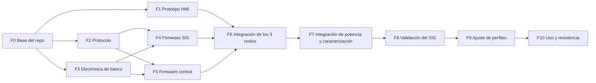

# Plan maestro de implementación — QuitaSicote3000

Versión 2 · 2026-09-30 · Electrónica y firmware de todo el sistema.

---

## 0. Cómo leer este documento (personas y agentes de IA)

### 0.1 Propósito
Este documento es la **referencia principal** para implementar el sistema completo: electrónica, firmware de los tres nodos, pruebas y orden de trabajo. Está escrito para que otra persona u otro agente de IA pueda continuar el proyecto **sin el historial de conversación**.

### 0.2 Etiquetas de estado
Cada dato o decisión importante lleva una etiqueta. Respétalas:

| Etiqueta | Significado | ¿Se puede cambiar sin consultar? |
|---|---|---|
| **[CONFIRMADO]** | Dato o decisión dada explícitamente por el usuario | **No** |
| **[DECIDIDO]** | Propuesta aceptada por el usuario (ADR aceptado) | No, salvo error técnico demostrado |
| **[PROPUESTA]** | Sugerencia técnica no confirmada por el usuario | Sí, justificándolo |
| **[POR MEDIR]** | Valor que debe salir de un ensayo; el número escrito es provisional | Sí, con el resultado del ensayo |
| **[VERIFICAR]** | Dato externo (hoja de datos, placa) aún no comprobado | Sí, al comprobarlo |
| **[ABIERTO]** | Falta una decisión del usuario | No: preguntar |

### 0.3 Reglas para quien modifique el proyecto
1. Ante un conflicto entre este plan y otro documento del repo, **no elijas en silencio**: corrige el que esté mal y anótalo en el registro de cambios (§15).
2. **Nunca** muevas lógica de seguridad al control o al HMI. El SIS no acepta umbrales ni órdenes que relajen la seguridad por la comunicación: **lo que recibe sólo puede restringir**.
3. El HMI **no decide nada**: muestra lo que envía la Mega y hace solicitudes. Nunca envía temperaturas ni minutos.
4. **No añadir componentes auxiliares sueltos** (compuertas, transistores, diodos, resistencias, fusibles) [CONFIRMADO]. Toda lógica de combinación de señales se hace por software. Si algo es imposible sin un componente, se plantea como decisión [ABIERTO].
5. Los nombres de constantes de la §12 son los que deben usarse en el código.
6. Documentación y comentarios en **español**; identificadores de código en **inglés**.
7. Al terminar una fase, actualiza su estado en la §10 y el registro de cambios.

### 0.4 Documentos relacionados
| Documento | Contenido |
|---|---|
| [pinout/](pinout/README.md) | **Pinout de cada controlador** (Mega, Nano, ESP32): única fuente de números de pin |
| [requisitos.md](requisitos.md) | Requisitos RF/RS/RD |
| [arquitectura.md](arquitectura.md) | Resumen de nodos y responsabilidades |
| [maquina-de-estados.md](maquina-de-estados.md) | Ciclo de la Mega (resumen) |
| [perfiles-de-tratamiento.md](perfiles-de-tratamiento.md) | Calzado × intensidad × duración |
| [comunicacion.md](comunicacion.md) | Enlaces (resumen; el detalle de bytes está en §6) |
| [seguridad-sis.md](seguridad-sis.md) | SIF y pruebas V-xx (resumen) |
| [decisiones/](decisiones/README.md) | ADRs |
| [../firmware/hmi/PLAN.md](../firmware/hmi/PLAN.md) | Plan detallado de la interfaz LVGL |

---

## 1. Qué es el sistema

Equipo **doméstico** [CONFIRMADO] que elimina el mal olor del calzado haciendo circular aire caliente por una recámara cerrada. El usuario elige tipo de calzado, intensidad y duración en una pantalla táctil; el equipo calienta con una resistencia PTC, ventila y enfría.

### 1.1 Nodos [CONFIRMADO]

| Nodo | Placa | Función |
|---|---|---|
| **Control** | Arduino Mega 2560 | Ciclo de tratamiento, sensores de proceso, SSR del PTC |
| **SIS** | Arduino Nano (ATmega328P) | Seguridad independiente: relé de permiso del PTC y los dos ventiladores de la recámara |
| **HMI** | ESP32-32E con pantalla 3.2" (E32R32P) | Interfaz táctil; **sólo comunicación**, sin entradas ni salidas de proceso |

### 1.2 Capas de protección
```
Capa 3  Termostato 80 °C en serie con el PTC              → hardware puro
Capa 2  SIS (Nano): su propio termopar y relé de permiso  → software mínimo e independiente
Capa 1  Control (Mega): límites de software sobre el SSR  → lógica de proceso
```
Cada capa puede apagar el PTC **por sí sola**: TH1 abre el circuito, el SIS abre RL1, la Mega apaga SSR1.

### 1.3 Datos confirmados por el usuario (procedencia)
- Producto doméstico; se controla **sólo desde la pantalla**; **no hay botón físico de paro**.
- Control = Mega; SIS = Nano (que sea original o clon es irrelevante); la pantalla ESP32-32E sólo se comunica.
- 3 termopares tipo K con 3 MAX6675; SHT31 (T/HR); SGP40 (VOC). SHT31 y SGP40 toleran 5 V.
- 2 SSR de DC: uno para el PTC y otro para el ventilador de circulación.
- PTC de **100 W a 12 V** con ventilador propio; ese ventilador tiene alimentación separada y lo conmuta un **módulo de relé de 12 V** (configurable; se eligió **NC + disparo por nivel alto**).
- **Otro módulo de relé en serie con el PTC** como permiso del SIS.
- Ventilador de la cámara de circuitos conectado **directo a 12 V**.
- Todos los ventiladores son de **12 V y 2 cables** (sin tacómetro).
- **Un solo termostato de 80 °C, de rearme automático.** "No hay ninguna situación donde deba alcanzarse esa temperatura a menos que haya fuego."
- **No se añaden componentes auxiliares pequeños** (ni compuertas, transistores, diodos, resistencias o fusibles), ni un fusible térmico.
- **Dos reguladores de 5 V** (uno para el control y otro para el SIS).
- Limit switch de puerta: se usan **ambos contactos, NA y NC**.
- Fuente externa de **12 V / 20 A**. Corriente de arranque del PTC **desconocida**.
- Inicio de ciclo **sólo con la puerta cerrada**. Pausa máxima **5 min**.
- Enclavado en EEPROM y **bloqueo tras 2 eventos** (se decidió para el termostato; ver §7.7 por qué hay que reformularlo).
- **4 tipos de calzado**, intensidad y duración con **3 opciones** cada una, sin valores ni porcentajes visibles.
- Pantalla en **horizontal**.

---

## 2. Estado actual (2026-09-30)

| Área | Estado |
|---|---|
| Documentación de arquitectura | Hecha (este plan + `docs/`) |
| Código | **No existe**. Carpetas `firmware/*/src` vacías |
| Plan del HMI | Escrito ([PLAN.md](../firmware/hmi/PLAN.md)), sin empezar |
| Hardware | El usuario tiene los componentes de §1.3. Falta el 2.º módulo de relé (RL1), apto para la corriente del PTC |
| Ensayos | Ninguno |

---

## 3. Requisitos clave (resumen)

Detalle en [requisitos.md](requisitos.md). Los que más condicionan el diseño:

- **RS-01** El PTC nunca se energiza con la puerta abierta.
- **RS-02** El PTC nunca supera el límite de seguridad aunque falle el control.
- **RS-03** El PTC nunca queda energizado sin flujo de aire.
- **RS-04** Pérdida de alimentación, de comunicación o de sensor ⇒ calentador apagado.
- **RS-05** Un fallo del control no puede desactivar al SIS.
- **RF-03** Inicio sólo con la puerta cerrada (HMI, Mega y SIS lo comprueban).
- **RD-03** Si la Mega pierde al HMI más de 10 s durante un ciclo, cancela y enfría.
- **RD-04** Tras un corte de energía, el ciclo no se reanuda.

---

## 4. Decisiones

### 4.1 Tomadas

| ID | Decisión | Estado |
|---|---|---|
| A-1 | El SIS corta el PTC con un **módulo de relé (RL1) en serie** | [DECIDIDO] ([ADR-0010](decisiones/ADR-0010-permiso-ptc-modulo-rele.md)) |
| A-2 | **Sin componentes auxiliares pequeños** | [CONFIRMADO] ([ADR-0011](decisiones/ADR-0011-sin-componentes-auxiliares.md)) |
| A-3 | **Dos reguladores de 5 V** independientes | [CONFIRMADO] |

Consecuencias de A-2 que ya están aplicadas en este plan:
- **El Nano maneja directamente** RL1 (permiso del PTC), RL2 (ventilador del PTC) y SSR2 (ventilador de circulación). La Mega sólo **solicita** los ventiladores por la comunicación. Las combinaciones AND/OR se hacen por software en el SIS.
- **El SIS no puede leer nodos de 12 V** (haría falta un divisor de resistencias). No ve directamente el termostato, el estado real de RL1 ni si el ventilador del PTC tiene tensión. Las funciones de seguridad se basan en TC3, la puerta y el estado que informa la Mega (§7.5).
- Sin resistencias en serie en la puerta, ni pull-downs: se usan los pull-ups internos y el comportamiento por defecto de los módulos [VERIFICAR en F3].

### 4.2 Abiertas

| ID | Pregunta | Opciones | Recomendación | Bloquea |
|---|---|---|---|---|
| **A-9** | Nivel lógico del enlace Mega → ESP32: la Mega emite 5 V y el ESP32 **no tolera** más de 3,6 V | **1)** Módulo convertidor de nivel lógico (placa lista de 4 canales). **2)** Emular salida en drenador abierto por software en la Mega (sin hardware, más complejo y lento). **3)** Conectar 5 V directo: fuera de especificación, puede dañar el ESP32 | **1** | F6 |
| **A-10** | Protección contra cortocircuitos sin fusibles | **1)** Aceptar sólo la protección de la fuente (≈ 20–25 A). **2)** Permitir al menos un fusible general y uno en las ramas de cable fino | **2**: un cortocircuito en un cable fino (ventiladores, reguladores) se calienta mucho antes de que salte la protección de una fuente de 20 A | F3 |
| **A-11** | El termostato no se puede leer (§7.7). ¿Se aplica el enclavado en EEPROM con bloqueo tras 2 eventos a los **eventos térmicos que el SIS sí detecta** (sobretemperatura, subida brusca, calentamiento sin efecto)? | Sí / no | Sí | F4 |
| **A-4** | Si el SIS deja de recibir al control con el PTC permitido, ¿disparo enclavado o sólo retirar el permiso? | — | Disparo enclavado | F4 |
| **A-5** | Procedimiento de servicio tras el bloqueo | Ver §7.9 | Comando por USB de la Mega + secuencia de puerta | F4 |
| **A-6** | ¿VOC/HR como criterio de fin anticipado? | Sí / no / sólo informativo | Sólo informativo hasta tener datos | F9 |
| **A-7** | Registro de ciclos | CSV por USB de la Mega / SD del HMI | CSV por USB desde el principio; SD después | F5 |
| **A-8** | Nombres de los 4 calzados | — | Cuero, Deportivo, Bota, Sintético | F1 |

---

## 5. Electrónica

### 5.0 Componentes y designadores

| Ref. | Componente | Estado |
|---|---|---|
| PSU | Fuente externa 12 V / 20 A | [CONFIRMADO] |
| J1 | Conector de entrada de 12 V con polaridad (p. ej. XT60) | [PROPUESTA] (es un conector, no un componente auxiliar) |
| TH1 | Termostato 80 °C NC, rearme automático | [CONFIRMADO] |
| **RL1** | **Módulo de relé de 12 V, permiso del PTC**: contacto **NA**, disparo por nivel **ALTO**, contacto apto para **≥ 30 A en DC** | Tipo [DECIDIDO]; especificación [PROPUESTA] |
| SSR1 | SSR DC-DC (MOSFET) para el PTC | [CONFIRMADO]; especificación [PROPUESTA] |
| SSR2 | SSR DC-DC para el ventilador de circulación | [CONFIRMADO] |
| RL2 | Módulo de relé de 12 V del ventilador del PTC: contacto **NC**, disparo **ALTO** | [CONFIRMADO] |
| PTC | Calefactor PTC 100 W / 12 V | [CONFIRMADO] |
| FAN_P | Ventilador del PTC (12 V, 2 cables) | [CONFIRMADO] |
| FAN_C | Ventilador de circulación (12 V, 2 cables) | [CONFIRMADO] |
| FAN_B | Ventilador de la cámara de circuitos (12 V, 2 cables) | [CONFIRMADO] |
| REG_A | Regulador 12 → 5 V, ≥ 2 A, conmutado (buck): lado control | [CONFIRMADO]; especificación [PROPUESTA] |
| REG_B | Regulador 12 → 5 V, ≥ 1 A, conmutado: lado SIS | [CONFIRMADO]; especificación [PROPUESTA] |
| SW1 | Limit switch de puerta SPDT (COM, NA, NC) | [CONFIRMADO] |
| TC1–TC3 + M1–M3 | Termopar K + módulo MAX6675 | [CONFIRMADO] |
| S1 | Módulo SHT31 (I2C 0x44) | [CONFIRMADO] |
| S2 | Módulo SGP40 (I2C 0x59) | [CONFIRMADO] |
| MCU_C | Arduino Mega 2560 | [CONFIRMADO] |
| MCU_S | Arduino Nano | [CONFIRMADO] |
| HMI | Placa ESP32-32E 3.2" | [CONFIRMADO] |
| LS1 | Módulo convertidor de nivel lógico 5 V ↔ 3,3 V | [ABIERTO A-9] |
| F* | Fusibles | [ABIERTO A-10]; por ahora **no** se incluyen |

### 5.1 Presupuesto de corriente (12 V)

| Carga | Corriente | Estado |
|---|---|---|
| PTC en régimen | ≈ 8,3 A | Calculado (100 W / 12 V) |
| PTC en el arranque | Mayor: un PTC frío tiene menos resistencia | [POR MEDIR] F7 |
| FAN_P, FAN_C, FAN_B | ≈ 0,1–0,5 A cada uno | [POR MEDIR] |
| Bobinas de RL1 y RL2 | ≈ 0,07–0,2 A cada una | [VERIFICAR] modelo |
| Lógica a 5 V (Mega, Nano, HMI con retroiluminación, sensores) | ≈ 0,6 A a 5 V ⇒ ≈ 0,3 A a 12 V | Estimado |
| **Total** | **≈ 9,5–10 A en régimen** | La fuente de 20 A tiene margen |

### 5.2 Distribución de potencia

```
PSU 12 V ─ J1 ─┬── TH1 ── RL1 (COM → NA) ── PTC(+)  PTC(−) ── SSR1 salida(+)  SSR1 salida(−) ── GND
               │
               ├── RL2 (COM → NC) ── FAN_P(+)        FAN_P(−) ── GND
               ├── FAN_C(+)        FAN_C(−) ── SSR2 salida(+)  SSR2 salida(−) ── GND
               ├── FAN_B(+)        FAN_B(−) ── GND                          (siempre encendido)
               ├── VCC de los módulos RL1 y RL2 (bobinas de 12 V)
               │
               ├── REG_A ── 5V_A ──► Mega (pin 5V), HMI (USB-C), S1, S2, M1, M2, LS1 lado 5 V
               └── REG_B ── 5V_B ──► Nano (pin 5V), M3
```

Notas:
- **SSR1 y SSR2 en el lado bajo** (entre la carga y GND) [PROPUESTA], la configuración habitual de los SSR DC-DC [VERIFICAR con el modelo].
- **FAN_P no pasa por TH1, RL1 ni SSR1**: sigue funcionando cuando la rama del PTC está cortada.
- **REG_A y REG_B alimentan el pin 5V** de cada placa, saltándose sus reguladores lineales (que a 12 V se calentarían).
- **Programación por USB**: con el regulador conectado al pin 5V, **no conectes también el USB** (el 5 V del USB y el del regulador quedarían unidos). En banco, alimenta por USB y deja el regulador desconectado; en el equipo integrado, al revés.
- **Placa HMI**: por USB-C desde 5V_A, o por el VCC de su conector serie si es entrada de 5 V [VERIFICAR].
- **Módulos de relé**: VCC a 12 V, GND común, IN desde el Nano. Comprobar en F3 que una salida de 5 V del Nano los activa con disparo ALTO [VERIFICAR] y que con la entrada **al aire** quedan desactivados.

### 5.3 Rama del PTC

- **Orden**: PSU → TH1 → RL1 (contacto NA) → PTC → SSR1 → GND. Cualquiera de los tres que abra apaga el PTC.
- **RL1** [DECIDIDO]: módulo de relé con disparo ALTO; energizado = permitido. Si el Nano se reinicia o se apaga, su pin queda al aire y RL1 se abre. **El contacto debe soportar la corriente del PTC en DC**: los módulos comunes de 10 A (relé tipo SRD) **no sirven**; usar uno de **30 A** (relé tipo SLA) y comprobar su especificación en DC [VERIFICAR].
- **SSR1**: DC-DC de salida MOSFET, especificado para **≥ 40 A** si es un modelo genérico (los "25DD" de bajo costo suelen soportar mucho menos de lo indicado), con disipador [PROPUESTA]. Entrada de 3–32 V DC, manejada a 5 V por la Mega.
- **Conmutación lenta** del SSR1: ventana proporcional de 2 s con mínimo 100 ms encendido/apagado (§8.6). RL1 **no** conmuta en cada ventana: se cierra al empezar a calentar y se abre al terminar, para no desgastar sus contactos.
- **Cableado**: ≥ 14 AWG (2,5 mm²) en toda la rama; terminales y conectores de ≥ 15 A continuos; retorno propio a la estrella de tierra. Si A-10 queda en "sin fusibles", el cableado principal y el de la rama del PTC deben soportar la corriente máxima de la fuente: **12 AWG (4 mm²)**.

### 5.4 Ventiladores

| Ventilador | Lo maneja | Reposo / falla | Supervisión |
|---|---|---|---|
| FAN_P (PTC) | **Nano** (D6) → RL2, contacto **NC**, disparo **ALTO** | Pin al aire o relé sin energizar ⇒ **encendido** | Ninguna eléctrica; subida de TC3 (SIF-03) |
| FAN_C (circulación) | **Nano** (D5) → SSR2 | Pin al aire ⇒ apagado | Ninguna |
| FAN_B (cámara de circuitos) | Nadie: directo a 12 V | Siempre encendido | Ninguna |

- La Mega pide `fan_c_on_request` y `fan_p_off_request` en `HB_CTRL`. El SIS **enciende FAN_C** si lo pide la Mega **o** si lo exige la seguridad, y **apaga FAN_P sólo** si lo pide la Mega **y** se cumplen sus condiciones de seguridad (§7.5). Una solicitud de la Mega nunca puede dejar un ventilador apagado cuando hace falta.
- Si el SIS se apaga: RL2 se desenergiza ⇒ FAN_P encendido; SSR2 se apaga ⇒ FAN_C apagado. El PTC no tiene permiso (RL1 abierto).
- **FAN_B** debe tomar aire del exterior, no de la recámara (caliente, húmeda y con vapores), con rejilla.

### 5.5 Sensores

| Sensor | Bus / dirección | Nodo | Montaje |
|---|---|---|---|
| TC1 + M1 | SPI | Mega | Aire de la recámara, cerca del calzado. Variable de control |
| TC2 + M2 | SPI | Mega | Aire a la salida del PTC (unos cm aguas abajo). Límite y diagnóstico de flujo |
| TC3 + M3 | SPI | Nano | Aire en el punto más caliente en caso de falla, **sin tocar las aletas del PTC**. Cerca de TH1 [POR MEDIR en F7] |
| S1 SHT31 | I2C 0x44 | Mega | Recámara, fuera del chorro directo del PTC |
| S2 SGP40 | I2C 0x59 | Mega | Trayecto de retorno o salida del aire, la zona **más fresca**: su rango de operación tiene un máximo cercano a 50 °C [VERIFICAR hoja de datos] |
| SW1 | Digital | Mega y Nano | COM a GND; NA a un pin de cada MCU; NC a otro pin de cada MCU |

**MAX6675** (comportamiento para el firmware):
- Sólo termopar K. Resolución 0,25 °C. Conversión ≈ 220 ms: leer como mucho cada 250 ms por módulo; bajar CS aborta la conversión en curso.
- SPI modo 0, ≤ 4 MHz (usar 1 MHz). Se leen 16 bits: D15 = 0; D14–D3 = temperatura × 4 (12 bits); **D2 = 1 ⇒ termopar abierto**; D1 = 0; D0 indeterminado.
- Usar termopares de **unión aislada**: una unión que toque metal unido a GND (carcasa del PTC) altera la lectura.
- Cable de extensión tipo K, trenzado, lejos de los cables de potencia. Módulos lejos del calor.

**Puerta (SW1)**: COM → GND; NA → un pin de la Mega y uno del Nano; NC → otro pin de cada uno. **Conexión directa** con pull-up interno en ambos MCU. Puerta cerrada = actuador presionado ⇒ NA cerrado (BAJO) y NC abierto (ALTO). Tabla de interpretación en §7.4.
Si uno de los dos MCU está sin alimentación, sus diodos de protección arrastran las líneas a BAJO y el otro lee "NA BAJO + NC BAJO" = inválido = puerta abierta: falla segura.

### 5.6 Enlaces serie

| Enlace | Conexión | Niveles |
|---|---|---|
| Mega ↔ Nano | Mega TX1 → Nano D0 **directo**; Nano D1 → Mega RX1 | 5 V / 5 V. El Nano tiene 1 kΩ entre su conversor USB y D0: la Mega debe manejar D0 directo para imponerse. Para programar el Nano, desconectar este enlace |
| Mega ↔ HMI | Mega TX2 → **LS1** → ESP32 IO32 (RX de UART2); ESP32 IO25 (TX de UART2) → LS1 → Mega RX2 | 5 V ↔ 3,3 V vía LS1 [ABIERTO A-9]. UART2 del ESP32 reasignado al conector I2C de la placa: UART0/USB queda para depurar |

Velocidad: **57600 baudios 8N1 en ambos enlaces** [PROPUESTA] (a 16 MHz, 57600 tiene −0,8 % de error; 115200 tiene +2,1 %).
GND común entre los tres nodos (obligatorio para UART).

### 5.7 Asignación de pines

Cada controlador tiene su propio documento, con todos los pines, a qué terminal de qué componente va cada uno, polaridad, estado durante el reinicio y constantes del firmware:

| Controlador | Documento |
|---|---|
| Arduino Mega 2560 (control) | [pinout/mega.md](pinout/mega.md) |
| Arduino Nano (SIS) | [pinout/nano.md](pinout/nano.md) |
| ESP32-32E (HMI) | [pinout/esp32-hmi.md](pinout/esp32-hmi.md) |
| Cables entre controladores y polaridades | [pinout/README.md](pinout/README.md) |

Esos documentos son la **única fuente** de números de pin.

### 5.8 Tierra, cableado y ruido
- **Tierra en estrella** en el negativo de la fuente. Retornos separados para: rama del PTC, ventiladores, REG_A, REG_B. Los 8 A del PTC no comparten cable con la lógica.
- Cables de potencia y de señal separados; los de termopar, trenzados.
- Los módulos de regulador y de relé ya traen sus condensadores y diodos: no se añade nada.
- Pasacables en la recámara; nada de cable de señal pegado al PTC.

### 5.9 Comportamiento ante fallas de hardware

| Falla | Efecto inmediato | Cómo se detecta | Reacción |
|---|---|---|---|
| SSR1 en cortocircuito | PTC encendido sin orden | La Mega ve TC1 > setpoint + 5 °C; el SIS ve TC3 subir (SIF-01/03) | La Mega pasa a FALLA y retira `heat_request` ⇒ el SIS abre RL1. Si la Mega no reacciona, SIF-01 abre RL1 |
| RL1 con contacto soldado | El SIS no puede cortar | **No se detecta** (no hay realimentación) | SSR1 sigue controlando; TH1 como última barrera. Revisar RL1 en la validación periódica (F8) |
| RL1 no cierra | No calienta | Timeout de precalentamiento (Mega) | FALLA(5) |
| TH1 abierto | PTC sin corriente | **Indirecto**: calentamiento sin efecto (SIF-08 inferida) | Disparo enclavado del SIS (§7.7) |
| RL2 trabado energizado (FAN_P apagado) | PTC sin flujo | Subida rápida de TC3 (SIF-03), TC2 > máx. (Mega) | Disparo |
| Motor de FAN_P o FAN_C trabado | Sin flujo | Igual que arriba; timeout de precalentamiento | Disparo o FALLA |
| TC3 abierto o congelado | SIS ciego | Bit D2, rango, lectura congelada | SIF-04 |
| TC1/TC2 abiertos | Control ciego | Bit D2, rango | Falla clase A en la Mega |
| Cable de puerta cortado | — | Combinación NA/NC inválida | Se trata como puerta abierta |
| Cae REG_A | Mega y HMI apagados; SSR1 sin señal | El SIS deja de recibir `HB_CTRL` | El SIS retira el permiso (RL1), mantiene FAN_P y fuerza FAN_C si está caliente |
| Cae REG_B | Nano apagado: RL1 abierto, FAN_P encendido, FAN_C apagado | La Mega deja de recibir `HB_SIS` | La Mega apaga SSR1 y pasa a FALLA(7) |
| Se cuelga el Nano | — | WDT (250 ms) | Reinicio ⇒ ARRANQUE ⇒ RL1 abierto |
| Se cuelga la Mega | — | WDT (1 s) y `HB_CTRL` | Reinicio ⇒ AUTOTEST; el SIS retira el permiso |
| Se cuelga el HMI | Sin interfaz | La Mega no recibe `HMI_HB` > 10 s | Cancela el ciclo y enfría |
| Cae la fuente de 12 V | Todo apagado | — | Al volver: AUTOTEST → LISTO, sin reanudar |
| EEPROM del SIS corrupta | — | CRC | Se trata como disparo enclavado que requiere rearme [PROPUESTA] |

---

## 6. Firmware común

### 6.1 Herramientas y estructura

- **PlatformIO**, un proyecto por nodo, con versiones de plataforma **fijadas**.
- Framework Arduino en los tres.
- C++ compatible con **C++11** en todo lo compartido (el compilador AVR); sin excepciones ni RTTI; sin STL en AVR.

```
firmware/
├─ compartido/
│  └─ protocolo/
│     ├─ library.json
│     └─ src/
│        ├─ qs_ids.h          enums compartidos (estados, fallas, perfiles, bits)
│        ├─ qs_protocol.h     tipos de mensaje, estructuras, tamaños
│        └─ qs_protocol.cpp   CRC16, codificación, parser con resincronización
├─ control/                   platformio.ini, src/, lib/, test/
├─ sis/                       platformio.ini, src/, lib/, test/
└─ hmi/                       platformio.ini, include/lv_conf.h, src/
```

- Cada `platformio.ini` incluye `lib_extra_dirs = ../compartido`.
- **La lógica pura vive en `lib/`** (sin `#include <Arduino.h>`), y `src/` sólo contiene la unión con el hardware. Así la lógica se prueba en PC con `pio test -e native` (Unity).

| Proyecto | Entornos |
|---|---|
| control | `megaatmega2560`, `native` |
| sis | `nanoatmega328new` (Optiboot); si la carga falla, `nanoatmega328` (bootloader antiguo); `native` |
| hmi | `esp32dev` |

**CI [PROPUESTA]**: `.github/workflows/ci.yml` que compila los tres proyectos y ejecuta los tests `native` en cada push.

### 6.2 Unidades y representación

| Magnitud | Representación | Ejemplo |
|---|---|---|
| Temperatura en el SIS y el protocolo SIS | `int16_t` en **cuartos de grado** (`_q2`) | 68 °C = 272 |
| Temperatura hacia el HMI | `int16_t` en **décimas de grado** (`_x10`) | 45,3 °C = 453 |
| Humedad | `uint16_t` décimas de % | 38,5 % = 385 |
| Tiempos | `uint32_t` ms internamente; `uint16_t` segundos en el protocolo | |
| Valor inválido | `INT16_MIN` (0x8000) / `UINT16_MAX` (0xFFFF) | |

El SIS **no usa `float`**. La Mega puede usarlo en el PID y en el algoritmo de VOC.

### 6.3 Trama

| Offset | Campo | Bytes | Notas |
|---|---|---|---|
| 0 | SOF = `0xAA` | 1 | |
| 1 | LEN = longitud del payload | 1 | 0–32; mayor ⇒ descartar |
| 2 | TYPE | 1 | §6.4 |
| 3 | SEQ | 1 | Contador del emisor, módulo 256 |
| 4 | PAYLOAD | LEN | Little-endian, estructuras empaquetadas |
| 4+LEN | CRC16 | 2 | Byte bajo primero |

- **CRC-16/CCITT-FALSE**: polinomio 0x1021, valor inicial 0xFFFF, sin reflexión, XOR final 0. Se calcula sobre los offsets 1 … 3+LEN (LEN, TYPE, SEQ y payload). Vector de prueba: `"123456789"` → **0x29B1**.
- Trama máxima: 38 bytes.
- **Parser**: máquina de estados byte a byte (esperar SOF → LEN → TYPE → SEQ → payload → CRC). Si LEN > 32 o el CRC falla, se descarta y se busca el siguiente `0xAA` **a partir del byte siguiente al SOF descartado**. Contadores de errores de CRC y de longitud.
- Sin relleno de bytes (byte stuffing): la resincronización la dan SOF + LEN + CRC.

### 6.4 Mensajes

**Mega ↔ Nano** (57600)

| TYPE | Nombre | Sentido | Periodo | Payload |
|---|---|---|---|---|
| 0x01 | `HB_CTRL` | Mega → Nano | 100 ms | `u8 proto_ver`, `u8 cycle_state`, `u8 ctrl_flags`, `u8 reservado` |
| 0x02 | `HB_SIS` | Nano → Mega | 100 ms | ver abajo (9 bytes) |
| 0x03 | `REQ_RESET` | Mega → Nano | evento | `u8 magic = 0x5A`, `u16 trip_mask_ack` (debe coincidir con el `trip_mask` vigente) |
| 0x04 | `EVENT` | Nano → Mega | evento | `u8 event`, `u16 trip_mask`, `u8 detalle` |
| 0x05 | `REQ_SERVICE` | Mega → Nano | evento | `u8 magic1 = 0xC3`, `u8 magic2 = 0x3C`, `u8 op` (1 = desbloquear) |

`ctrl_flags` (HB_CTRL): b0 `heat_request` (la Mega está en un estado de calentamiento), b1 `fan_p_off_request`, b2 `fan_c_on_request`, b3 `ssr1_cmd` (valor actual de la salida SSR1).

`HB_SIS` (9 bytes):

| Offset | Tipo | Campo |
|---|---|---|
| 0 | u8 | `proto_ver` |
| 1 | u8 | `sis_state`: 0 ARRANQUE, 1 OK, 2 DISPARADO, 3 BLOQUEADO |
| 2 | u16 | `trip_mask`: b0–b7 = SIF-01…SIF-08 (b4 sin uso); b11 EEPROM inválida; b15 enclavado persistente |
| 4 | i16 | `tc3_q2` |
| 6 | u8 | `io_flags`: b0 puerta cerrada, b1 puerta inválida, b2 permiso del PTC (RL1 ordenado), b3 FAN_P encendido (RL2 sin energizar), b4 FAN_C encendido |
| 7 | u8 | `thermal_events` (contador en EEPROM, saturado) |
| 8 | u8 | reservado |

`EVENT.event`: 1 DISPARO, 2 REARME_OK, 3 REARME_RECHAZADO, 4 AUTOTEST_FALLIDO, 5 BLOQUEO, 6 DESBLOQUEO_SERVICIO.

**Mega ↔ HMI** (57600)

| TYPE | Nombre | Sentido | Periodo | Payload |
|---|---|---|---|---|
| 0x10 | `HMI_HB` | HMI → Mega | 500 ms | `u8 proto_ver`, `u8 screen_id` |
| 0x11 | `REQ_START` | HMI → Mega | evento | `u8 shoe_id`, `u8 intensity_id`, `u8 duration_id` |
| 0x12 | `REQ_PAUSE` | HMI → Mega | evento | — |
| 0x13 | `REQ_RESUME` | HMI → Mega | evento | — |
| 0x14 | `REQ_CANCEL` | HMI → Mega | evento | — |
| 0x15 | `REQ_ACK` | HMI → Mega | evento | `u8 fault_code` (0 = aceptar "Completo") |
| 0x16 | `REQ_REARM` | HMI → Mega | evento | — (la Mega lo traduce a `REQ_RESET`) |
| 0x20 | `STATUS` | Mega → HMI | 200 ms | ver abajo (28 bytes) |
| 0x21 | `RESP_START` | Mega → HMI | evento | `u8 result`: 0 OK, 1 PUERTA_ABIERTA, 2 NO_LISTO, 3 ID_INVALIDO, 4 FALLA_ACTIVA |
| 0x22 | `LOG` | Mega → HMI | — | Reservado para una fase posterior (registro en SD) |

`STATUS` (28 bytes):

| Offset | Tipo | Campo |
|---|---|---|
| 0 | u8 | `proto_ver` |
| 1 | u8 | `cycle_state` |
| 2 | u8 | `door`: 0 cerrada, 1 abierta, 2 inválida |
| 3 | u8 | `sis_state` |
| 4 | u16 | `trip_mask` |
| 6 | u8 | `fault_code` |
| 7 | u8 | `warn_flags`: b0 SHT31 en falla, b1 SGP40 en falla, b2 VOC en aprendizaje |
| 8 | u8 | `shoe_id` (0xFF sin ciclo) |
| 9 | u8 | `intensity_id` |
| 10 | u8 | `duration_id` |
| 11 | u8 | `pause_reason`: 0 ninguna, 1 puerta, 2 usuario |
| 12 | u16 | `remaining_s` |
| 14 | u16 | `total_s` |
| 16 | u16 | `pause_left_s` |
| 18 | i16 | `t_chamber_x10` (TC1) |
| 20 | u16 | `rh_x10` |
| 22 | u16 | `voc_index` (1–500) |
| 24 | u8 | `act_flags`: b0 PTC encendido (SSR1), b1 FAN_C, b2 FAN_P |
| 25 | u8 | `thermal_events` |
| 26 | u16 | reservado |

### 6.5 Enumeraciones compartidas (`qs_ids.h`)

`cycle_state`: 0 AUTOTEST, 1 LISTO, 2 PRECALENTAMIENTO, 3 TRATAMIENTO, 4 PAUSA, 5 ENFRIAMIENTO, 6 COMPLETO, 7 FALLA.

Perfiles: `shoe_id` 0 Cuero, 1 Deportivo, 2 Bota, 3 Sintético · `intensity_id` 0 Suave, 1 Media, 2 Intensa · `duration_id` 0 Corta, 1 Media, 2 Larga.

`fault_code`:

| Código | Nombre | Clase | Mensaje para el usuario (HMI) |
|---|---|---|---|
| 0 | NINGUNA | — | — |
| 1 | TC1_INVALIDO | A | Falla del sensor de temperatura de la recámara |
| 2 | TC2_INVALIDO | A | Falla del sensor de temperatura del calefactor |
| 3 | SHT31_FALLA | B | (aviso) Sensor de humedad no disponible |
| 4 | SGP40_FALLA | B | (aviso) Sensor de olor no disponible |
| 5 | PRECAL_TIMEOUT | A | El equipo no alcanzó la temperatura. Revisa los ventiladores |
| 6 | SOBRETEMP_SW | A | Temperatura demasiado alta |
| 7 | SIS_SIN_ENLACE | A | Falla interna de comunicación |
| 8 | SIS_DISPARO | A | Protección de seguridad activada (detalle en `trip_mask`) |
| 9 | (reservado) | — | — |
| 10 | PUERTA_INVALIDA | A | Falla del sensor de la puerta |
| 11 | TOPE_CICLO | — | (no es falla: fin por tiempo máximo) |
| 12 | HMI_SIN_ENLACE | — | Sólo se registra |
| 13 | BLOQUEO | A | Equipo bloqueado. Requiere servicio técnico |

**Clase A**: detiene el calentamiento y lleva a FALLA. **Clase B**: aviso; el ciclo continúa.

---

## 7. Firmware del SIS (Arduino Nano)

### 7.1 Principios
- Lazo cíclico de **10 ms** con `millis()`.
- **Watchdog de 250 ms**: al arrancar, `MCUSR = 0; wdt_disable();` y luego `wdt_enable(WDTO_250MS)`; `wdt_reset()` una vez por iteración.
- Sin bibliotecas de terceros; MAX6675 por SPI del hardware; UART con `Serial`.
- Sin `String`, sin `malloc`, sin `float`.
- Umbrales en `src/config/sis_params.h` como `constexpr`. **Ninguno se recibe por la comunicación.**
- **La comunicación sólo puede restringir**: un dato de la Mega puede retirar un permiso, provocar un disparo o pedir encender un ventilador; nunca concede un permiso ni apaga un ventilador si las condiciones propias del SIS no lo permiten.

### 7.2 Módulos
```
sis/
├─ lib/sis_logic/          lógica pura, probada en PC
│  ├─ door.h/.cpp          interpretación NA/NC + antirrebote
│  ├─ tc_validator.h/.cpp  validez de TC3 (abierto, rango, congelado)
│  ├─ trend.h/.cpp         pendiente de TC3 y "calentamiento sin efecto"
│  ├─ sif.h/.cpp           evaluación de las SIF y de las salidas
│  ├─ sis_fsm.h/.cpp       ARRANQUE / OK / DISPARADO / BLOQUEADO
│  └─ persist.h/.cpp       formato de EEPROM + CRC (con interfaz de almacenamiento simulable)
└─ src/
   ├─ main.cpp             lazo, WDT, planificación
   ├─ hw_io.cpp            puerta y salidas (RL1, RL2, SSR2)
   ├─ hw_max6675.cpp       SPI
   ├─ hw_eeprom.cpp        implementación sobre <EEPROM.h>
   ├─ link.cpp             HB_SIS, recepción de HB_CTRL / REQ_*
   └─ config/sis_params.h, sis_pins.h
```

### 7.3 Planificación del lazo

| Periodo | Tarea |
|---|---|
| 10 ms | Leer la puerta, procesar bytes del UART, evaluar las SIF, actualizar salidas, `wdt_reset()` |
| 100 ms | Enviar `HB_SIS`; registrar `ssr1_cmd` recibido para la estadística de SIF-08 |
| 250 ms | Leer TC3; actualizar la ventana de pendiente |

Tiempo de respuesta esperado puerta → RL1 abierto: antirrebote (30 ms) + un ciclo (10 ms) + liberación del relé (≈ 10 ms) ≈ **50 ms** (requisito < 200 ms).

### 7.4 Entradas e interpretación

**Puerta** (la combinación debe mantenerse 30 ms):

| NA | NC | Resultado |
|---|---|---|
| BAJO | ALTO | CERRADA |
| ALTO | BAJO | ABIERTA |
| BAJO | BAJO | INVÁLIDA (cortocircuito, switch dañado, otro MCU sin alimentación) |
| ALTO | ALTO | INVÁLIDA (cable o común cortado) |

INVÁLIDA se trata como ABIERTA y además se informa.

**TC3 válido** si: bit D2 = 0, −10 °C ≤ T ≤ 150 °C, y no está "congelado" (mismo valor crudo durante más de 60 s con el permiso concedido). Tres lecturas malas seguidas ⇒ inválido.

### 7.5 Funciones de seguridad (pseudocódigo)

```
door_ok     = (door == CERRADA)
hb_ok       = (ahora - ultimo_HB_CTRL) <= HB_CTRL_TIMEOUT_MS
permit      = valor actual de la salida RL1 (lo que el SIS ordena)

SIF-01  tc3_valid && tc3 >= T_SIS_MAX                                → disparo, evento térmico
SIF-02  !door_ok                                                     → inhibir (no enclava)
SIF-03  permit && (tc3 - tc3_hace_10s) >= SIF03_SLOPE_Q2_10S         → disparo, evento térmico [umbral POR MEDIR]
SIF-04  !tc3_valid                                                   → disparo
SIF-05  (retirada: no hay realimentación eléctrica, ADR-0011)
SIF-06  !hb_ok && permit                                             → disparo [ABIERTO A-4]
SIF-07  permit continuo > SIF07_MAX_HEAT_MIN                         → disparo
        (el contador se reinicia sólo tras SIF07_COOL_OFF_MIN con el permiso retirado)
SIF-08  "Calentamiento sin efecto" (posible termostato abierto):
        permit && ssr1_cmd == 1 en ≥ SIF08_DUTY_PCT % de los HB de los últimos SIF08_WINDOW_S
        && tc3 bajó ≥ SIF08_DROP_Q2 en esa ventana                   → disparo, evento térmico [POR MEDIR]
```

Salidas:
```
RL1 permiso (D4, ALTO = permitido)
   = (estado == OK) && door_ok && !disparo && hb_ok
     && heat_request(HB_CTRL) && tc3_valid && tc3 < T_SIS_MAX

FAN_C (D5, ALTO = encendido)
   = fan_c_on_request(HB_CTRL)
     || permit || disparo || (estado != OK)
     || (tc3_valid && tc3 >= T_FRIO) || !tc3_valid

FAN_P apagado (D6, ALTO = apagar)
   = fan_p_off_request(HB_CTRL)
     && (estado == OK) && !permit && !disparo
     && permiso retirado desde hace >= FAN_P_OFF_HOLD_S
     && tc3_valid && tc3 < T_FRIO
```

Uso de los datos de la Mega: `heat_request` sólo puede **quitar** el permiso; `fan_c_on_request` sólo puede **encender**; `fan_p_off_request` sólo cuenta si las condiciones propias del SIS lo permiten; `ssr1_cmd` sólo puede **provocar** un disparo (SIF-08).

### 7.6 Estados del SIS

| Estado | RL1 | Entra cuando | Sale cuando |
|---|---|---|---|
| ARRANQUE | Abierto | Encendido o reinicio | Autotest correcto ⇒ OK (o DISPARADO/BLOQUEADO según la EEPROM) |
| OK | Según §7.5 | Autotest o rearme correcto | Cualquier disparo ⇒ DISPARADO |
| DISPARADO | Abierto | Disparo | `REQ_RESET` válido ⇒ OK |
| BLOQUEADO | Abierto | 2.º evento térmico [A-11] | Procedimiento de servicio (§7.9) |

**Autotest del SIS** (ARRANQUE, < 2 s):
1. EEPROM: magic y CRC correctos; si no, b11 y estado DISPARADO.
2. TC3 válido.
3. Puerta en una combinación válida (cerrada o abierta).

**Rearme** (`REQ_RESET` con `magic = 0x5A` y `trip_mask_ack == trip_mask`): se acepta sólo si la causa desapareció, `tc3 < T_SIS_RESET`, la puerta es válida y el estado no es BLOQUEADO. Responde `EVENT` REARME_OK o REARME_RECHAZADO.

### 7.7 Termostato, eventos térmicos y EEPROM

La decisión original ([ADR-0008](decisiones/ADR-0008-termostato-rearme-automatico.md)) era que el SIS **leyera el termostato** y lo enclavara. Sin divisor de resistencias (A-2), un pin de 5 V no puede leer un nodo de 12 V. Propuesta para conservar la intención [ABIERTO A-11]:

- Se cuentan como **evento térmico** los disparos SIF-01, SIF-03 y SIF-08. Son las situaciones en las que el termostato abriría o estaría a punto de abrir.
- 1.er evento: disparo **enclavado y guardado en EEPROM**; rearme según §7.6.
- 2.º evento: **BLOQUEADO** hasta el procedimiento de servicio.
- Que TC3 esté junto a TH1 (§5.5) hace que SIF-01 actúe antes que el termostato en casi todos los casos.

Formato de la EEPROM:

| Dirección | Tipo | Campo |
|---|---|---|
| 0–1 | u16 | magic `0x5153` ("QS") |
| 2 | u8 | versión del formato (1) |
| 3 | u8 | `thermal_events` |
| 4–5 | u16 | `latched_trip_mask` |
| 6 | u8 | `lockout` (0/1) |
| 7 | u8 | CRC-8 (polinomio 0x31, inicio 0xFF) de los bytes 0–6 |

Escribir **sólo en eventos** (`EEPROM.update`).

### 7.8 Mensajes que el SIS ignora
Cualquier mensaje que no sea `HB_CTRL`, `REQ_RESET` o `REQ_SERVICE`. Ningún mensaje cambia umbrales.

### 7.9 Procedimiento de servicio [ABIERTO A-5, PROPUESTA]
Desbloquear exige **presencia física**:
1. El técnico envía `servicio desbloquear` por la consola USB de la Mega, que manda `REQ_SERVICE` (op = 1).
2. El SIS sólo lo acepta si, en los 30 s siguientes, la puerta se abre y se cierra **3 veces** y TC3 < T_SIS_RESET.
3. Pone `lockout = 0` y `thermal_events = 0`, y emite `EVENT` DESBLOQUEO_SERVICIO.

---

## 8. Firmware de control (Arduino Mega)

### 8.1 Principios
- Planificador cooperativo con `millis()`; ninguna tarea bloquea más de 5 ms; sin `delay()`.
- **Watchdog de 1 s.**
- Sin `String`; buffers estáticos.
- Cada lectura con calidad: VÁLIDA, OBSOLETA (sin actualizar en 3 periodos) o FALLA.
- La Mega sólo maneja **SSR1**. Los ventiladores los **solicita** al SIS en `HB_CTRL`.

### 8.2 Módulos
```
control/
├─ lib/ctrl_logic/           lógica pura, probada en PC
│  ├─ cycle_fsm.h/.cpp       máquina de estados (§8.4)
│  ├─ profiles.h/.cpp        tabla de perfiles (§8.5)
│  ├─ heat_ctrl.h/.cpp       histéresis / PI + ventana proporcional
│  ├─ fan_requests.h/.cpp    cuándo pedir FAN_C y el apagado de FAN_P
│  ├─ faults.h/.cpp          clasificación y prioridad de fallas
│  └─ door.h/.cpp            misma lógica NA/NC que el SIS
└─ src/
   ├─ main.cpp, scheduler.cpp
   ├─ sensors/  max6675.cpp, sht31.cpp, sgp40.cpp (+ algoritmo de índice VOC), door_hw.cpp
   ├─ actuators/ ssr1.cpp
   ├─ links/    sis_link.cpp, hmi_link.cpp
   ├─ console/  service_console.cpp, csv_log.cpp
   └─ config/   ctrl_params.h, ctrl_pins.h
```

### 8.3 Planificación

| Periodo | Tarea |
|---|---|
| 10 ms | UART (ambos enlaces), puerta con antirrebote de 30 ms |
| 100 ms | `HB_CTRL`; ventana del SSR1 |
| 200 ms | `STATUS` al HMI |
| 250 ms | Leer un MAX6675, alternando TC1 y TC2 (cada uno cada 500 ms) |
| 1 s | SHT31 (ordenar la medición en un tick y leerla en el siguiente), SGP40 (medición compensada con T/HR del SHT31, ~30 ms) + algoritmo de índice VOC, control de temperatura, temporizadores del ciclo, línea CSV |

Bibliotecas sugeridas: Sensirion "I2C SGP40" y "Gas Index Algorithm"; SHT31 de Sensirion o Adafruit. El índice VOC necesita muestras regulares a 1 Hz y tiene un periodo inicial de aprendizaje (`warn_flags` b2).

### 8.4 Máquina de estados

| Estado | Acciones al entrar | Mientras | Transiciones |
|---|---|---|---|
| AUTOTEST | SSR1 off; pedir FAN_P encendido | Comprobar: TC1/TC2 válidos; SHT31 responde; autotest del SGP40 (comando 0x280E → 0xD400); `HB_SIS` recibido con `sis_state` OK; puerta válida | Todo OK ⇒ LISTO. Falla A ⇒ FALLA. Sin `HB_SIS` en 5 s ⇒ FALLA(7) |
| LISTO | SSR1 off, `heat_request = 0` | Pedir el apagado de los ventiladores sólo si TC2 < T_FRIO durante FAN_OFF_HOLD_S | `REQ_START` válido + puerta cerrada + SIS OK ⇒ PRECALENTAMIENTO (`RESP_START` 0). Si no ⇒ `RESP_START` con el motivo |
| PRECALENTAMIENTO | Pedir FAN_P y FAN_C encendidos; `heat_request = 1` | Control hacia `setpoint` cuando `HB_SIS` indique permiso concedido; contar `PREHEAT_TIMEOUT_MIN` | TC1 ≥ setpoint − TREAT_BAND_C ⇒ TRATAMIENTO. Puerta abierta o `REQ_PAUSE` ⇒ PAUSA. `REQ_CANCEL` ⇒ ENFRIAMIENTO. Timeout ⇒ FALLA(5). Falla A ⇒ FALLA |
| TRATAMIENTO | — | Control; el tiempo de tratamiento sólo avanza con TC1 ≥ setpoint − TREAT_BAND_C | Tiempo cumplido ⇒ ENFRIAMIENTO. Tope global ⇒ ENFRIAMIENTO (11). Puerta / pausa / cancelar / falla igual que arriba |
| PAUSA | SSR1 off, `heat_request = 0`, ventiladores pedidos; `pause_left = 300 s` | Cuenta atrás | `REQ_RESUME` + puerta cerrada + SIS OK ⇒ PRECALENTAMIENTO (conserva el tiempo de tratamiento acumulado). `pause_left = 0` ⇒ ENFRIAMIENTO. `REQ_CANCEL` ⇒ ENFRIAMIENTO |
| ENFRIAMIENTO | SSR1 off, `heat_request = 0`, ventiladores pedidos | — | TC1 < COOL_END_TC1_C y TC2 < COOL_END_TC2_C, o COOL_MAX_MIN ⇒ COMPLETO (o LISTO si viene de una falla o cancelación) |
| COMPLETO | — | Ventiladores hasta enfriar (regla de LISTO) | `REQ_ACK(0)` o apertura de la puerta ⇒ LISTO |
| FALLA | SSR1 off, `heat_request = 0`, ventiladores pedidos | Mostrar `fault_code` | `REQ_ACK` con la causa resuelta ⇒ ENFRIAMIENTO ⇒ LISTO. SIS DISPARADO: `REQ_REARM` ⇒ `REQ_RESET` al SIS. SIS BLOQUEADO ⇒ se queda en FALLA(13) |

Reglas generales:
- Tras reinicio o corte: siempre AUTOTEST → LISTO.
- Sin `HMI_HB` > 10 s con un ciclo activo ⇒ ENFRIAMIENTO (se registra el código 12).
- Sin `HB_SIS` > 500 ms ⇒ SSR1 off y FALLA(7).
- La puerta abierta apaga SSR1 de inmediato en la Mega (redundante con el SIS).

### 8.5 Perfiles [hipótesis, POR MEDIR en F9]

`setpoint` en °C del aire de recámara (TC1):

| `shoe_id` | Suave | Media | Intensa |
|---|---|---|---|
| 0 Cuero | 35 | 40 | 45 |
| 1 Deportivo | 40 | 45 | 50 |
| 2 Bota | 40 | 45 | 50 |
| 3 Sintético | 38 | 42 | 48 |

Duración del tratamiento: Corta 20 min, Media 40 min, Larga 70 min. Tope global de ciclo: 120 min.

### 8.6 Control de temperatura
- **Etapa 1 (F5)**: histéresis sobre TC1 (encender si < setpoint − 0,5 °C; apagar si > setpoint + 0,5 °C) con un mínimo de 5 s encendido o apagado.
- **Etapa 2 (F9)**: PI con salida 0–100 % y ventana proporcional de 2 s (mínimo 100 ms on/off), anti-windup por saturación. Ganancias [POR MEDIR].
- **Arranque suave del PTC** [PROPUESTA, sólo si F7 muestra que el arranque hace caer la fuente]: limitar el ciclo de trabajo durante los primeros 20 s.
- **Límites**:
  - TC2 > TC2_MAX_C ⇒ salida a 0 hasta que baje de TC2_RESUME_C.
  - TC1 > setpoint + SOFT_OVERTEMP_MARGIN_C ⇒ FALLA(6).
- La salida de SSR1 sólo se activa con `heat_request = 1`, la puerta cerrada y `HB_SIS` indicando permiso concedido (`io_flags` b2).
- `fan_p_off_request` sólo se envía con `heat_request = 0`, SSR1 apagado y TC2 < T_FRIO; el SIS hace su propia comprobación.

### 8.7 Consola de servicio y registro (USB, 115200)
- **CSV a 1 Hz** durante los ciclos (y siempre en las compilaciones de ensayo):
  `t_ms,state,sp,tc1,tc2,tc3,rh,voc,duty,ssr1,permit,fan_c,fan_p,door,sis_state,trip_mask,fault`
- Comandos de texto: `status`, `log on|off`, `servicio desbloquear` (§7.9).
- **Sólo con la bandera de compilación `QS_TEST_BUILD`**: `duty <0-100>` (control manual para los ensayos de F7) y `hmi <comando>` (simular el HMI sin pantalla). **Nunca** en la compilación de uso.

---

## 9. Firmware del HMI (ESP32-32E)

Plan detallado: [firmware/hmi/PLAN.md](../firmware/hmi/PLAN.md). Resumen:
- LVGL 9 + LovyanGFX, PlatformIO, pantalla en horizontal (320 × 240).
- Zonas táctiles ≥ 56 px (≈ 11 mm); texto ≥ 20 px; fuentes generadas con acentos.
- Primero, un prototipo con **simulador de la Mega** (`mock_link`); después, `uart_link` con el protocolo de §6.
- **Enlace**: UART2 reasignado a IO25 (TX) / IO32 (RX), `Serial2.begin(57600, SERIAL_8N1, 32, 25)`. UART0/USB queda para depurar.
- Pantallas a partir de `STATUS`: `cycle_state` decide la pantalla; `sis_state == BLOQUEADO` ⇒ "Equipo bloqueado"; evento térmico (`trip_mask` b0, b2 o b7) ⇒ "Se detectó sobrecalentamiento. Revisa los ventiladores" con el botón Rearmar; `fault_code` ⇒ textos de §6.5.
- Sin `STATUS` > 2 s ⇒ "Sin comunicación".
- `HMI_HB` cada 500 ms.

---

## 10. Fases de implementación

Estado de todas las fases: **pendiente** (actualizar aquí).



F1, F2 y F3 pueden avanzar en paralelo.

### F0 — Base del repositorio
- **Tareas**: `platformio.ini` de los tres proyectos con versiones fijadas; `library.json` de `compartido/protocolo`; carpetas `lib/` de lógica; `sis_params.h`, `ctrl_params.h` con los nombres de §12; workflow de CI; `.clang-format`.
- **Hecho cuando**: `pio run` compila los tres proyectos (vacíos) y `pio test -e native` se ejecuta en control y sis, en local y en CI.

### F1 — Prototipo del HMI
- **Tareas**: fases F0–F7 de [PLAN.md](../firmware/hmi/PLAN.md).
- **Depende de**: F0. Decisión A-8.
- **Hecho cuando**: se cumplen los criterios de PLAN.md, incluida la prueba de usabilidad con dedo y stylus.

### F2 — Biblioteca de protocolo
- **Tareas**: enums (§6.5), estructuras (§6.4), CRC16 con su vector, codificador, parser con resincronización, contadores de error.
- **Pruebas `native`**: tramas válidas de cada tipo; CRC erróneo; LEN > 32; basura antes del SOF; trama partida en varios bloques; dos tramas pegadas; `0xAA` dentro del payload; secuencia aleatoria de 10 000 bytes sin bloquear el parser.
- **Hecho cuando**: todas las pruebas pasan y el parser ocupa ≤ 64 bytes de RAM en el Nano.

### F3 — Electrónica de banco (sin PTC)
- **Depende de**: A-9 (para el enlace con el HMI), A-10, y tener RL1.
- **Tareas**:
  1. Montar la distribución de §5.2 con **carga ficticia** en lugar del PTC: lámpara automotriz de 12 V/21 W o resistencia de potencia.
  2. Ajustar REG_A y REG_B a 5,0–5,1 V antes de conectar placas.
  3. Cablear puerta, MAX6675, S1, S2 y los módulos de relé según [pinout/](pinout/README.md).
  4. Comprobar continuidad, polaridad y estrella de tierra.
- **Mediciones y comprobaciones**:
  - 5V_A y 5V_B en vacío y con carga; rizado < 100 mV pico a pico.
  - RL1 y RL2: se activan con 5 V del Nano y **quedan desactivados con la entrada al aire** (Nano desconectado o en reinicio).
  - SSR1 y SSR2: quedan apagados con la entrada al aire.
  - Temperatura del SSR1 con la carga ficticia.
- **Hecho cuando**: todo dentro de lo esperado y anotado en `docs/ensayos/F3.md`.

### F4 — Firmware del SIS
- **Depende de**: F2, F3, A-4, A-5, A-11.
- **F4a, lógica en PC**: cada SIF con casos que disparan y que no; las 4 combinaciones de la puerta y el antirrebote; TC congelado; pendiente y "calentamiento sin efecto"; EEPROM (formato, CRC, 1.er y 2.º evento, corrupción); rearme aceptado y rechazado; "la comunicación sólo restringe" (ningún `HB_CTRL` concede el permiso ni apaga FAN_P con condiciones inseguras).
- **F4b, drivers en el Nano**: MAX6675, salidas, WDT, EEPROM, enlace.
- **F4c, banco**: con RL1/RL2/SSR2 reales y carga ficticia; medir el tiempo puerta → RL1 con osciloscopio o analizador lógico.
- **Hecho cuando**: tests `native` en verde; respuesta de la puerta < 200 ms medida; el WDT reinicia ante un bucle infinito forzado (en compilación de prueba).

### F5 — Firmware de control
- **Depende de**: F2, F3, A-7.
- **F5a**: planificador, drivers de sensores, CSV por USB. Lecturas estables durante 1 h.
- **F5b, lógica en PC**: todas las transiciones de §8.4; pausa de 5 min; tope de 120 min; corte de energía en cada estado; perfiles e ids fuera de rango; prioridad de fallas; solicitudes de ventiladores.
- **F5c**: SSR1 con carga ficticia; ventana del SSR.
- **F5d**: enlace con el SIS (heartbeats, permiso, solicitudes de ventiladores, rearme) y comandos `hmi` de la consola para probar sin pantalla.
- **Hecho cuando**: un ciclo completo con carga ficticia recorre todos los estados y las fallas inyectadas se manejan como en §8.4.

### F6 — Integración de los tres nodos
- **Depende de**: A-9.
- **Tareas**: `uart_link` en el HMI sustituye a `mock_link`; cableado de §5.6; pruebas de pérdida de cada enlace (desconectar cables durante el ciclo).
- **Hecho cuando**: un ciclo se controla entero desde la pantalla con carga ficticia y cada pérdida de enlace produce la reacción de §5.9.

### F7 — Integración de potencia y caracterización (con PTC real, sin calzado)
- **Seguridad durante los ensayos**: siempre con supervisión; PTC sobre superficie no inflamable; extintor a mano; compilación `QS_TEST_BUILD` con `duty` limitado; `T_SIS_MAX` provisional bajo (55 °C) hasta conocer las temperaturas normales.
- **Mediciones**:
  1. Corriente de arranque del PTC (pinza DC o shunt + osciloscopio) y si la fuente de 20 A la soporta; decidir el arranque suave.
  2. Temperatura de RL1 y SSR1 a 8,3 A durante 30 min.
  3. Curvas TC1/TC2/TC3 con ciclos de trabajo del 25, 50 y 100 % y ventiladores normales ⇒ **TC3 máxima en operación normal**.
  4. Temperatura de las aletas del PTC y del punto de montaje de TH1: TH1 no debe acercarse a 75 °C en operación normal.
  5. Con FAN_P desconectado y ciclo de trabajo bajo: pendiente de TC3 ⇒ umbral de SIF-03.
  6. Con TH1 puenteado abierto y el SSR al 100 %: caída de TC3 ⇒ parámetros de SIF-08.
  7. Temperatura interior de la cámara de circuitos tras 1 h.
- **Resultado**: valores de T_SIS_MAX, SIF-03, SIF-08, TC2_MAX y posiciones definitivas de TC3/TH1/S2, anotados en `docs/ensayos/F7.md` y en la §12.

### F8 — Validación del SIS
- **Tareas**: V-01 … V-12 de [seguridad-sis.md](seguridad-sis.md) en el equipo integrado, más SSR1 en corto (puenteado).
- **Hecho cuando**: todas pasan; tiempos de respuesta anotados en `docs/ensayos/F8.md`. **Repetir F8 tras cualquier cambio del firmware del SIS.**

### F9 — Ajuste de perfiles
- **Tareas**: ajuste del PI; las 36 combinaciones con calzado de prueba (TC1 dentro de ±2 °C del setpoint en tratamiento, sin sobrepasar el límite); duraciones; curvas de VOC/HR con calzado real ⇒ decisión A-6.
- **Hecho cuando**: tabla de perfiles definitiva en `profiles.cpp` y en §8.5.

### F10 — Uso y resistencia
- **Tareas**: prueba de usabilidad en el equipo real; 20 ciclos consecutivos; corte de energía en cada estado; 4 h continuas de funcionamiento.
- **Hecho cuando**: sin fallas no explicadas; versión 1.0 etiquetada en git.

---

## 11. Pruebas (resumen)

| Nivel | Qué | Dónde | Fase |
|---|---|---|---|
| Unitarias | Protocolo, SIF, máquina de estados, perfiles, puerta | PC (`native`) | F2, F4, F5 |
| HMI | Pantallas con simulador | ESP32 | F1 |
| Banco eléctrico | Reguladores, módulos de relé, SSR, sensores | Banco | F3 |
| Integración | Enlaces y fallas de enlace | Banco | F6 |
| Caracterización | Temperaturas, corrientes | Equipo | F7 |
| Validación del SIS | Inyección de fallas | Equipo | F8 |
| Perfiles | 36 combinaciones | Equipo | F9 |
| Resistencia y uso | Ciclos repetidos, personas | Equipo | F10 |

---

## 12. Tabla maestra de parámetros

Los nombres son los que debe usar el código.

**Compartidos (`qs_protocol.h`)**

| Constante | Valor | Estado |
|---|---|---|
| `QS_PROTO_VERSION` | 1 | [PROPUESTA] |
| `QS_BAUD_CTRL_SIS`, `QS_BAUD_CTRL_HMI` | 57600 | [PROPUESTA] |
| `QS_MAX_PAYLOAD` | 32 | [PROPUESTA] |
| `HB_PERIOD_MS` | 100 | [PROPUESTA] |
| `HB_SIS_TIMEOUT_MS` (lo usa la Mega) | 500 | [PROPUESTA] |
| `HB_CTRL_TIMEOUT_MS` (lo usa el SIS) | 2000 | [PROPUESTA] |
| `STATUS_PERIOD_MS` | 200 | [PROPUESTA] |
| `STATUS_TIMEOUT_MS` (lo usa el HMI) | 2000 | [PROPUESTA] |
| `HMI_HB_PERIOD_MS` | 500 | [PROPUESTA] |
| `HMI_LINK_TIMEOUT_MS` (lo usa la Mega) | 10000 | [PROPUESTA] |

**SIS (`sis_params.h`)**

| Constante | Valor | Estado |
|---|---|---|
| `SIS_LOOP_MS` | 10 | [PROPUESTA] |
| `SIS_WDT` | `WDTO_250MS` | [PROPUESTA] |
| `TC3_PERIOD_MS` | 250 | [PROPUESTA] |
| `T_SIS_MAX_Q2` | 272 (68 °C); 220 (55 °C) durante F7 | [POR MEDIR] F7 |
| `T_SIS_RESET_Q2` | 180 (45 °C) | [PROPUESTA] |
| `T_FRIO_Q2` | 140 (35 °C) | [PROPUESTA] |
| `TC3_MIN_VALID_Q2` / `TC3_MAX_VALID_Q2` | −40 (−10 °C) / 600 (150 °C) | [PROPUESTA] |
| `TC3_BAD_READS` | 3 | [PROPUESTA] |
| `TC3_FROZEN_MS` | 60000 | [PROPUESTA] |
| `DOOR_DEBOUNCE_MS` | 30 | [PROPUESTA] |
| `SIF03_SLOPE_Q2_10S` | 40 (10 °C en 10 s) | [POR MEDIR] F7 |
| `SIF07_MAX_HEAT_MIN` | 125 | [PROPUESTA] |
| `SIF07_COOL_OFF_MIN` | 10 | [PROPUESTA] |
| `SIF08_WINDOW_S` / `SIF08_DUTY_PCT` / `SIF08_DROP_Q2` | 60 / 80 / 12 (3 °C) | [POR MEDIR] F7 |
| `FAN_P_OFF_HOLD_S` | 60 | [PROPUESTA] |
| `THERMAL_EVENTS_LOCKOUT` | 2 | [DECIDIDO] (aplicado a eventos térmicos: A-11) |
| `SERVICE_DOOR_TOGGLES` / `SERVICE_WINDOW_MS` | 3 / 30000 | [ABIERTO A-5] |

**Control (`ctrl_params.h`)**

| Constante | Valor | Estado |
|---|---|---|
| `CTRL_WDT` | `WDTO_1S` | [PROPUESTA] |
| `TC_READ_PERIOD_MS` | 250 (alternando TC1/TC2) | [PROPUESTA] |
| `SSR_WINDOW_MS` / `SSR_MIN_ON_MS` | 2000 / 100 | [PROPUESTA] |
| `HYST_X10` / `HYST_MIN_STATE_MS` | 5 (0,5 °C) / 5000 | [PROPUESTA] |
| `PI_KP`, `PI_TI_S` | — | [POR MEDIR] F9 |
| `SOFT_OVERTEMP_MARGIN_C` | 5 | [PROPUESTA] |
| `TC2_MAX_C` / `TC2_RESUME_C` | 70 / 65 | [POR MEDIR] F7 |
| `TREAT_BAND_C` | 3 | [PROPUESTA] |
| `PREHEAT_TIMEOUT_MIN` | 15 | [PROPUESTA] |
| `PAUSE_MAX_S` | 300 | [CONFIRMADO] |
| `CYCLE_MAX_MIN` | 120 | [PROPUESTA] |
| `COOL_END_TC1_C` / `COOL_END_TC2_C` / `COOL_MAX_MIN` | 35 / 40 / 15 | [PROPUESTA] |
| `T_FRIO_C` / `FAN_OFF_HOLD_S` | 35 / 60 | [PROPUESTA] |
| `SIS_BOOT_WAIT_MS` | 5000 | [PROPUESTA] |
| Tabla de perfiles | §8.5 | [POR MEDIR] F9 |

**HMI**: ver [PLAN.md](../firmware/hmi/PLAN.md) (tamaños, colores, fuentes) y [pinout/esp32-hmi.md](pinout/esp32-hmi.md).

---

## 13. Riesgos principales

| Riesgo | Impacto | Mitigación | Fase |
|---|---|---|---|
| Temperatura de las aletas del PTC muy por encima de 80 °C en uso normal | TH1 y SIF-01 dispararían sin falla | Montar TC3/TH1 en el aire de salida, no en las aletas; medir | F7 |
| Corriente de arranque del PTC desconocida | Fuente en protección o contacto de RL1 dañado | Medir; arranque suave por firmware; RL1 de 30 A | F7 |
| Sin fusibles (A-10) | Cable fino en cortocircuito antes de que actúe la fuente | Recomendar fusibles; cableado de 12 AWG en la rama principal | F3 |
| SSR genérico sobrevalorado | Sobrecalentamiento, falla en corto | SSR ≥ 40 A con disipador; medir temperatura; RL1 en serie | F3, F7 |
| Contacto de RL1 soldado sin detección | El SIS pierde su capacidad de corte sin saberlo | Revisión en la validación periódica (F8); SSR1 y TH1 siguen actuando | F8 |
| El termostato no se puede leer | Un termostato que cicla no se enclava directamente | SIF-01 cerca de TH1; SIF-08 inferida; A-11 | F7, F8 |
| Enlace Mega → ESP32 a 5 V (A-9) | Daño del ESP32 si se conecta directo | Convertidor de nivel | F6 |
| Módulos de relé o SSR que no quedan apagados con la entrada al aire | Permiso o ventilador en estado inesperado durante un reinicio | Comprobar en F3; cambiar de módulo si falla | F3 |
| SGP40 fuera de su rango de temperatura | Lecturas erróneas o degradación | Montarlo en la zona fresca; verificar la hoja de datos | F7 |
| Mega y Nano con el mismo toolchain | Falla de causa común | SIS sin bibliotecas de terceros; validación tras cambios | F4 |
| Ventiladores sin tacómetro y sin sensado de tensión | Ventilador detenido sin detección directa | SIF-03, TC2_MAX, TH1 | F7, F8 |
| Sin paro físico | El usuario no puede parar si falla la pantalla | La puerta corta; RD-03; tope de ciclo | F8 |

---

## 14. Registro de decisiones (resumen de los ADR)

| ADR | Decisión | Estado |
|---|---|---|
| 0001 | Control y SIS en MCU independientes | [DECIDIDO] |
| 0002 | SIS en Nano, control en Mega | [CONFIRMADO] |
| 0003 | (Retirada; reemplazada por la 0010) | — |
| 0004 | TC1/TC2 al control, TC3 exclusivo del SIS | [PROPUESTA] |
| 0005 | Pantalla ESP32 como nodo HMI sólo de comunicación | [CONFIRMADO] |
| 0006 | Producto doméstico sin paro físico | [CONFIRMADO] |
| 0007 | Perfiles en la Mega; SIS con límite único | [PROPUESTA] |
| 0008 | Enclavado en EEPROM y bloqueo tras 2 eventos | [DECIDIDO]; reformulado a eventos térmicos [ABIERTO A-11] |
| 0009 | FAN_P por relé NC con disparo alto, manejado por el SIS | [DECIDIDO] |
| 0010 | Permiso del PTC con un módulo de relé en serie | [DECIDIDO] |
| 0011 | Sin componentes auxiliares pequeños; dos reguladores | [CONFIRMADO] |

---

## 15. Registro de cambios de este plan

| Fecha | Versión | Cambio |
|---|---|---|
| 2026-09-30 | 1 | Primera versión |
| 2026-09-30 | 2 | Decisiones del usuario: RL1 (módulo de relé) en serie con el PTC; sin componentes auxiliares; dos reguladores. Consecuencias: el Nano maneja RL1, RL2 y SSR2; la Mega pide los ventiladores; sin divisores ni compuertas ni fusibles; SIF-05 retirada; SIF-03 sólo por pendiente; SIF-08 pasa a "calentamiento sin efecto"; nuevas decisiones abiertas A-9 (nivel lógico del enlace con el HMI), A-10 (fusibles) y A-11 (eventos térmicos). Pinout separado por controlador en `docs/pinout/` |
