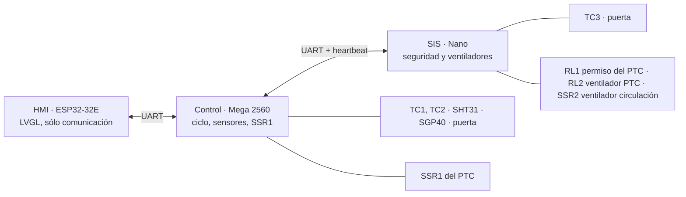

# Arquitectura

Resumen. Detalle completo en [PLAN-MAESTRO.md](PLAN-MAESTRO.md); pines en [pinout/](pinout/README.md).

## Capas de protección

```
Capa 3  Termostato 80 °C en serie con el PTC             → hardware, sin software
Capa 2  SIS (Nano): su propio termopar y relé de permiso → software mínimo e independiente
Capa 1  Control (Mega): límites sobre el SSR del PTC     → lógica de proceso
```

Cada capa apaga el PTC por sí sola. El HMI no es una capa de protección.

## Nodos y enlaces



## Reparto de responsabilidades

| Elemento | Control (Mega) | SIS (Nano) | HMI (ESP32) |
|---|---|---|---|
| TC1 (aire recámara), TC2 (salida PTC) | Lee | — | — |
| TC3 (junto al termostato) | — | Lee, exclusivo ([ADR-0004](decisiones/ADR-0004-asignacion-termopares.md)) | — |
| SHT31 (T/HR), SGP40 (VOC) | Lee | — | — |
| Puerta (contactos NA y NC) | Lee (pausa, inicio) | Lee (retira el permiso) | Muestra |
| SSR1 del PTC | Maneja | — | — |
| RL1, permiso del PTC | — | Maneja ([ADR-0010](decisiones/ADR-0010-permiso-ptc-modulo-rele.md)) | — |
| RL2, ventilador del PTC | Pide apagarlo | Maneja ([ADR-0009](decisiones/ADR-0009-ventilador-ptc-con-rele.md)) | — |
| SSR2, ventilador de circulación | Pide encenderlo | Maneja | — |
| Termostato 80 °C | — | No se puede leer; se infiere ([ADR-0008](decisiones/ADR-0008-termostato-rearme-automatico.md)) | — |
| Perfiles y setpoints | Decide ([ADR-0007](decisiones/ADR-0007-perfiles-en-el-control.md)) | — | Envía sólo identificadores |
| Disparo de seguridad | — | **Autoridad única** | Muestra |
| Interfaz con la persona | — | — | Sí |

## Principios

- El SIS no recibe umbrales por la comunicación; lo que recibe de la Mega **sólo puede restringir**.
- El HMI no decide nada: muestra lo que envía la Mega y le hace solicitudes que ella puede rechazar.
- Salidas con lógica "activo = permitido / apagado": un MCU colgado o sin alimentación deja el PTC sin permiso y el ventilador del PTC girando.
- Sin componentes auxiliares sueltos ([ADR-0011](decisiones/ADR-0011-sin-componentes-auxiliares.md)): toda combinación de señales se hace por software.
- Watchdog en Mega y Nano; heartbeat entre ambos.
- Una lectura de sensor inválida es una falla, nunca se ignora.
