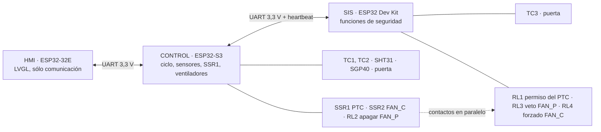

# Arquitectura

Resumen. Detalle completo en [PLAN-MAESTRO.md](PLAN-MAESTRO.md); pines en [pinout/](pinout/README.md).

> **Regla de máxima prioridad**: el **control** es el **ESP32-S3** y el **SIS** es el **ESP32 Dev Kit**. Ninguna función se mueve de uno a otro ([ADR-0012](decisiones/ADR-0012-regla-mega-control-nano-sis.md)).
> **Hardware**: sólo módulos y dispositivos; sin optoacopladores, convertidores de nivel ni fusibles ([ADR-0013](decisiones/ADR-0013-solo-modulos-y-dispositivos.md)).

## Capas de protección

```
Capa 3  Termostato bimetálico 80 °C en serie con el PTC   → hardware, sin software
Capa 2  SIS (ESP32 Dev Kit): su termopar y relé de permiso → software mínimo e independiente
Capa 1  Control (ESP32-S3): límites de proceso sobre el SSR → lógica de proceso
```

Cada capa apaga el PTC por sí sola. El HMI no es una capa de protección.

## Nodos y enlaces



## Reparto de responsabilidades

| Elemento | Control (ESP32-S3) | SIS (ESP32 Dev Kit) | HMI (ESP32-32E) |
|---|---|---|---|
| TC1 (aire recámara), TC2 (salida PTC) | Lee | — | — |
| TC3 (junto al termostato) | — | Lee, exclusivo ([ADR-0004](decisiones/ADR-0004-asignacion-termopares.md)) | — |
| SHT31 (T/HR), SGP40 (VOC) | Lee | — | — |
| Puerta (contactos NA y NC) | Lee (pausa, inicio) | Lee (retira el permiso) | Muestra |
| SSR1 del PTC | Maneja | — | — |
| RL1, permiso del PTC | — | Maneja ([ADR-0010](decisiones/ADR-0010-permiso-ptc-modulo-rele.md)) | — |
| Ventilador de circulación | Maneja (SSR2) | Puede forzarlo (RL4, contacto en paralelo) | — |
| Ventilador del PTC | Maneja (RL2) | Concede el apagado (RL3, contacto NC en paralelo) ([ADR-0009](decisiones/ADR-0009-ventilador-ptc-con-rele.md)) | — |
| Termostato 80 °C | — | No se puede leer con la opción T1; se infiere ([ADR-0008](decisiones/ADR-0008-termostato-rearme-automatico.md)) | — |
| Perfiles y setpoints | Decide ([ADR-0007](decisiones/ADR-0007-perfiles-en-el-control.md)) | — | Envía sólo identificadores |
| Disparo de seguridad | — | **Autoridad única** | Muestra |
| Interfaz con la persona | — | — | Sí |

## Principios

- Cuando una salida necesita la orden del control y una condición de seguridad, se combinan **con contactos de módulos de relé**, no moviendo funciones entre controladores.
- El SIS no recibe umbrales por la comunicación; lo que recibe del control **sólo puede restringir**.
- El HMI no decide nada: muestra lo que envía el control y le hace solicitudes que puede rechazar.
- Un controlador sin alimentación, arrancando o colgado deja sus relés sin energizar: el PTC queda sin permiso y el ventilador del PTC sigue girando.
- Watchdog en control y SIS; heartbeat entre ambos.
- Una lectura de sensor inválida es una falla, nunca se ignora.
