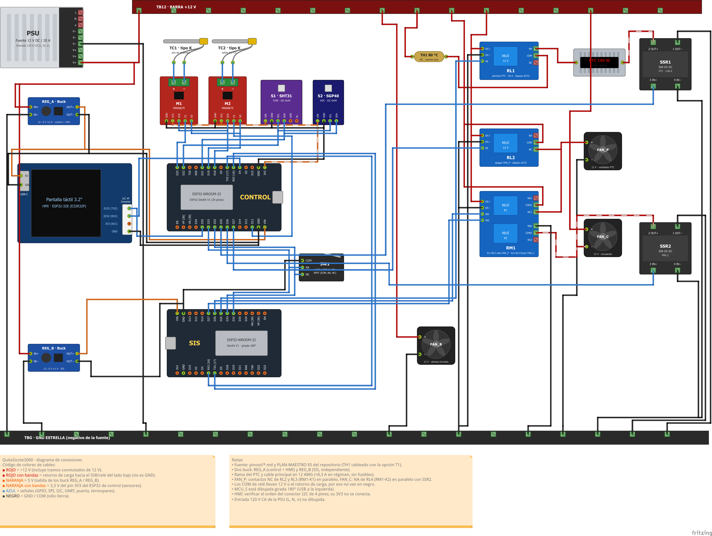

# Guía de conexión

Sigue los pasos **en orden**, con la fuente **desenchufada**. Marca cada ☐ al terminar.
Si la guía y los [pinout](../pinout/README.md) no coinciden, mandan los pinout.

Diagrama completo en alta resolución (7740 × 5829 px): [PNG](../../hardware/fritzing/QuitaSicote3000_conexiones_bb.png) · [Fritzing editable](../../hardware/fritzing/QuitaSicote3000_conexiones.fzz).
Pinouts de las placas y módulos: [ver tablas](#pinouts).
Recortes a escala completa: [1 Fuente](zona1-fuente-y-reguladores.png) · [2 Control y sensores](zona2-control-y-sensores.png) · [3 SIS y puerta](zona3-sis-y-puerta.png) · [4 Cargas](zona4-cargas.png).

| Color de cable | Significa |
|---|---|
| 🟥 Rojo | +12 V |
| 🟥 Rojo con bandas | Retorno de carga (lleva 12 V, **no** es tierra) |
| 🟧 Naranja | 5 V |
| 🟦 Azul | Señal de 3,3 V |
| ⬛ Negro | GND |

---

## ⚠️ Antes de empezar

- ☐ **Etiqueta las dos placas ESP32 como CONTROL y SIS.** Son idénticas; si se confunden, el equipo no es seguro.
- **Nunca pongas 12 V ni 5 V en un pin de señal (azul).** Destruye la placa.
- **Sin fusibles:** cable de **12 AWG** en la rama del calefactor; cables finos cortos y sujetos.
- Los **120 V de la fuente** no están en el diagrama: se conectan **al final**, con bornes tapados. Sin experiencia, que lo haga un electricista.
- **No conectes USB a una placa mientras su regulador de 5 V esté conectado.**
- Necesitas un **multímetro** y los firmwares cargados ([firmware/](../../firmware/README.md)): cárgalos **antes** de cablear, cada placa sola por USB.
- En el diagrama el SIS está **girado 180°**: guíate por la etiqueta del pin (`D25`, `GND`…), no por la posición.

---

## Paso 1 — Barras de 12 V y GND  📷 [zona 1](zona1-fuente-y-reguladores.png)

| Desde | Hacia | Cable |
|---|---|---|
| Fuente `V+` | Barra **TB12** | Rojo, 12 AWG |
| Fuente `V−` | Barra **TBG** (GND) | Negro, 12 AWG |

☐ Multímetro en continuidad: TB12 ↔ TBG **no** debe pitar.

## Paso 2 — Reguladores de 5 V  📷 [zona 1](zona1-fuente-y-reguladores.png)

| Desde | Hacia |
|---|---|
| TB12 | REG_A `IN+` y REG_B `IN+` |
| TBG | REG_A `IN−` y REG_B `IN−` (un cable cada uno) |

☐ Con la fuente encendida y **nada** en las salidas, gira el tornillo de cada regulador hasta medir **5,0–5,1 V** entre `OUT+` y `OUT−`. Apaga y desenchufa.

## Paso 3 — Sensores de CONTROL  📷 [zona 2](zona2-control-y-sensores.png)

| Desde | Hacia | Cable |
|---|---|---|
| CONTROL `3V3` | M1 `VCC`, M2 `VCC`, S1 `VIN`, S2 `VIN` | Naranja |
| CONTROL `GND` | M1 `GND`, M2 `GND`, S1 `GND`, S2 `GND` | Negro |
| CONTROL `D18` | M1 `SCK` y M2 `SCK` | Azul |
| CONTROL `D19` | M1 `SO` y M2 `SO` | Azul |
| CONTROL `D23` | M1 `CS` | Azul |
| CONTROL `D13` | M2 `CS` | Azul |
| CONTROL `D21` | S1 `SDA` y S2 `SDA` | Azul |
| CONTROL `D22` | S1 `SCL` y S2 `SCL` | Azul |
| Termopar TC1 | M1 `+` / `−` | |
| Termopar TC2 | M2 `+` / `−` | |

- Sensores a **3,3 V, no a 5 V**. `ADR` y `AL` del SHT31: sin conectar.
- Termopar: hilo positivo a `+` (en ANSI tipo K suele ser el amarillo). Si al calentar la lectura baja, están invertidos.

## Paso 4 — Puerta (SW1)  📷 [zona 3](zona3-sis-y-puerta.png)

| Desde | Hacia |
|---|---|
| SW1 `COM` | TBG |
| SW1 `NA` | CONTROL `D32` **y** SIS `D32` |
| SW1 `NC` | CONTROL `D33` **y** SIS `D33` |

El cable de `NA` (y el de `NC`) se divide en dos: uno a cada placa. Sin resistencias externas.

## Paso 5 — Alimentación de las placas

| Desde | Hacia | Cable |
|---|---|---|
| REG_A `OUT+` | CONTROL `VIN` | Naranja |
| REG_A `OUT−` | CONTROL `GND` | Negro |
| REG_A `OUT+` | Pantalla USB-C `5V` | Naranja |
| REG_A `OUT−` | Pantalla USB-C `GND` | Negro |
| REG_B `OUT+` | SIS `VIN` | Naranja |
| REG_B `OUT−` | SIS `GND` | Negro |

## Paso 6 — Enlaces entre placas  📷 [zona 1](zona1-fuente-y-reguladores.png) · [2](zona2-control-y-sensores.png) · [3](zona3-sis-y-puerta.png)

**TX va al RX del otro** (cruzados). Todos los GND de las placas, juntos.

| Desde | Hacia |
|---|---|
| CONTROL `D17` (TX2) | SIS `D16` (RX2) |
| SIS `D17` (TX2) | CONTROL `D16` (RX2) |
| CONTROL `D4` | Pantalla `IO32` |
| Pantalla `IO25` | CONTROL `D35` |
| Pantalla `GND` | CONTROL `GND` |

Los pines `IO25`, `IO32` y `GND` están en el **conector pequeño de 4 pines "I2C"** de la pantalla. **No conectes su `3V3`.**
☐ Identifica cada pin de ese conector con el multímetro antes de conectar (el orden no está confirmado).

## Paso 7 — Módulos de relé y SSR: 12 V y señales  📷 [zona 4](zona4-cargas.png)

| Módulo | Conexión | Hacia |
|---|---|---|
| RL1, RL2, RM1 | `DC+` | TB12 |
| RL1, RL2, RM1 | `DC−` | TBG |
| SSR1 | `4 IN−` | TBG |
| SSR2 | `4 IN−` | TBG |
| SSR1 | `3 IN+` | CONTROL `D25` |
| SSR2 | `3 IN+` | CONTROL `D26` |
| RL2 | `IN` | CONTROL `D27` |
| RL1 | `IN` | SIS `D25` |
| RM1 | `IN1` | SIS `D26` |
| RM1 | `IN2` | SIS `D27` |

RM1 con bobina de 12 V: confírmalo en la etiqueta de tu módulo (algunos son de 5 V).

## Paso 8 — Ventiladores  📷 [zona 4](zona4-cargas.png)

| Desde | Hacia | Cable |
|---|---|---|
| TB12 | FAN_B `+` | Rojo |
| FAN_B `−` | TBG | Negro |
| TB12 | RL2 `COM` | Rojo |
| TB12 | RM1 `COM1` | Rojo |
| RL2 `NC` | FAN_P `+` | Rojo |
| RM1 `NC1` | FAN_P `+` (mismo punto) | Rojo |
| FAN_P `−` | TBG | Negro |
| TB12 | FAN_C `+` | Rojo |
| FAN_C `−` | SSR2 `2 OUT+` | Rojo con bandas |
| FAN_C `−` | RM1 `COM2` (mismo punto) | Rojo con bandas |
| SSR2 `1 OUT−` | TBG | Negro |
| RM1 `NA2` | TBG | Negro |

## Paso 9 — Calefactor PTC  📷 [zona 4](zona4-cargas.png)

> ⚠️ **Último paso. Todo en 12 AWG con terminales bien apretados** (≈ 8,3 A). Para las primeras pruebas **usa una lámpara de 12 V / 21 W en lugar del PTC.**

`TB12 → TH1 → RL1 (COM→NA) → PTC → SSR1 → TBG`

| Desde | Hacia |
|---|---|
| TB12 | TH1 (un cable) |
| TH1 (otro cable) | RL1 `COM` |
| RL1 `NA` | PTC `+` (o lámpara) |
| PTC `−` (o lámpara) | SSR1 `2 OUT+` |
| SSR1 `1 OUT−` | TBG |

`RL1 NC` queda sin conectar. TH1 va en el aire caliente, **sin tocar las aletas** del PTC. SSR1 con disipador.

---

## Pinouts

Todos los pines de señal son de **3,3 V**. "Etiqueta" es lo que está impreso en la placa. Detalle completo: [control](../pinout/control-esp32.md) · [SIS](../pinout/sis-esp32.md) · [pantalla](../pinout/esp32-hmi.md).

### CONTROL (ESP32 DevKit V1)

| Etiqueta | GPIO | Dir. | Señal | Va a | ALTO / BAJO significa |
|---|---|---|---|---|---|
| `D25` | 25 | Salida | Calentar | SSR1 `3 IN+` | ALTO = calentar |
| `D26` | 26 | Salida | Ventilador de circulación | SSR2 `3 IN+` | ALTO = encender |
| `D27` | 27 | Salida | Pedir apagar FAN_P | RL2 `IN` | ALTO = pedir apagado |
| `D32` | 32 | Entrada | Puerta NA | SW1 `NA` (y SIS `D32`) | BAJO = contacto cerrado |
| `D33` | 33 | Entrada | Puerta NC | SW1 `NC` (y SIS `D33`) | BAJO = contacto cerrado |
| `D21` | 21 | E/S | I2C SDA | S1 `SDA`, S2 `SDA` | — |
| `D22` | 22 | Salida | I2C SCL | S1 `SCL`, S2 `SCL` | — |
| `D18` | 18 | Salida | SPI SCK | M1 `SCK`, M2 `SCK` | — |
| `D19` | 19 | Entrada | SPI MISO | M1 `SO`, M2 `SO` | — |
| `D23` | 23 | Salida | CS de TC1 | M1 `CS` | BAJO = seleccionado |
| `D13` | 13 | Salida | CS de TC2 | M2 `CS` | BAJO = seleccionado |
| `D17` (`TX2`) | 17 | Salida | Datos → SIS | SIS `D16` | UART 115200 |
| `D16` (`RX2`) | 16 | Entrada | Datos ← SIS | SIS `D17` | UART 115200 |
| `D4` | 4 | Salida | Datos → pantalla | Pantalla `IO32` | UART 115200 |
| `D35` | 35 | Entrada | Datos ← pantalla | Pantalla `IO25` | UART 115200 |
| `3V3` | — | Salida | 3,3 V | M1, M2, S1, S2 (`VCC`/`VIN`) | — |
| `VIN` | — | Entrada | 5 V | REG_A `OUT+` | — |
| `GND` | — | — | Tierra | TBG y todos los GND | — |

No uses otros pines: `0, 2, 5, 12, 14, 15` son de arranque y `1, 3, 6–11` son de USB y memoria.

### SIS (ESP32 DevKit V1)

| Etiqueta | GPIO | Dir. | Señal | Va a | ALTO / BAJO significa |
|---|---|---|---|---|---|
| `D25` | 25 | Salida | Permiso para calentar | RL1 `IN` | ALTO = permitido |
| `D26` | 26 | Salida | Permitir apagar FAN_P | RM1 `IN1` (RL3) | ALTO = se permite apagar |
| `D27` | 27 | Salida | Forzar FAN_C | RM1 `IN2` (RL4) | ALTO = forzar encendido |
| `D32` | 32 | Entrada | Puerta NA | SW1 `NA` (y CONTROL `D32`) | BAJO = contacto cerrado |
| `D33` | 33 | Entrada | Puerta NC | SW1 `NC` (y CONTROL `D33`) | BAJO = contacto cerrado |
| `D17` (`TX2`) | 17 | Salida | Datos → CONTROL | CONTROL `D16` | UART 115200 |
| `D16` (`RX2`) | 16 | Entrada | Datos ← CONTROL | CONTROL `D17` | UART 115200 |
| `VIN` | — | Entrada | 5 V | REG_B `OUT+` | — |
| `GND` | — | — | Tierra | TBG | — |

El SIS no tiene sensores ni termopares. Pines libres: `13, 18, 19, 21, 22, 23` (no conectar nada).

### Pantalla HMI (ESP32-32E)

Solo se usan estas conexiones externas; el resto de la placa ya viene cableado.

| Conector | Pin | Dir. | Señal | Va a |
|---|---|---|---|---|
| I2C (4 pines, 1,25 mm) | `IO25` | Salida | Datos → CONTROL (UART2 TX) | CONTROL `D35` |
| I2C (4 pines, 1,25 mm) | `IO32` | Entrada | Datos ← CONTROL (UART2 RX) | CONTROL `D4` |
| I2C (4 pines, 1,25 mm) | `GND` | — | Tierra | CONTROL `GND` |
| I2C (4 pines, 1,25 mm) | `3V3` | — | **No conectar** | — |
| USB-C | `5V` | Entrada | Alimentación | REG_A `OUT+` |
| USB-C | `GND` | — | Tierra | REG_A `OUT−` |

### Módulos (terminales)

| Módulo | Terminales y a dónde van |
|---|---|
| **M1 / M2** (MAX6675) | `VCC` ← 3V3 · `GND` · `SCK` ← D18 · `SO` → D19 · `CS` ← D23 (M1) o D13 (M2) · `+`/`−` ← termopar |
| **S1** (SHT31) | `VIN` ← 3V3 · `GND` · `SDA` ← D21 · `SCL` ← D22 · `ADR`, `AL` sin conectar |
| **S2** (SGP40) | `VIN` ← 3V3 · `GND` · `SDA` ← D21 · `SCL` ← D22 |
| **SW1** | `COM` → GND · `NA` → D32 (ambas placas) · `NC` → D33 (ambas placas) |
| **RL1** (30 A) | `DC+` ← 12 V · `DC−` → GND · `IN` ← SIS D25 · `COM` ← TH1 · `NA` → PTC `+` · `NC` sin conectar |
| **RL2** | `DC+` ← 12 V · `DC−` → GND · `IN` ← CONTROL D27 · `COM` ← 12 V · `NC` → FAN_P `+` · `NA` sin conectar |
| **RM1** (2 relés) | `DC+` ← 12 V · `DC−` → GND · `IN1` ← SIS D26 · `IN2` ← SIS D27 · `COM1` ← 12 V · `NC1` → FAN_P `+` · `COM2` ↔ FAN_C `−` · `NA2` → GND · `NA1`, `NC2` sin conectar |
| **SSR1** | `3 IN+` ← CONTROL D25 · `4 IN−` → GND · `2 OUT+` ← PTC `−` · `1 OUT−` → GND |
| **SSR2** | `3 IN+` ← CONTROL D26 · `4 IN−` → GND · `2 OUT+` ← FAN_C `−` · `1 OUT−` → GND |
| **REG_A / REG_B** | `IN+` ← 12 V · `IN−` → GND · `OUT+` → 5 V a su placa · `OUT−` → GND de su placa |

---

## Revisión (fuente desenchufada)

☐ TB12 ↔ TBG: **no** pita.
☐ `3V3` ↔ `GND` de CONTROL: **no** pita.
☐ Salidas `OUT+` ↔ `OUT−` de REG_A y REG_B: **no** pita.
☐ `D25`/`D26`/`D27` de CONTROL y SIS ↔ TB12: **no** pita.
☐ Todos los GND ↔ TBG: **sí** pita.
☐ Terminales gruesos apretados (tira de cada cable).

## Primer encendido

1. ☐ **Solo fuente y reguladores** (sin cables a las placas): TB12 = 12 V, reguladores = 5,0–5,1 V. FAN_B y FAN_P giran.
2. ☐ **Conecta las placas.** La pantalla enciende (la primera vez: toca las 4 esquinas para calibrar).
   - Punto arriba a la derecha: 🟢 verde = hay comunicación · 🔴 rojo = revisa el paso 6.
   - Abre y cierra la puerta: la pantalla debe cambiar entre "Puerta abierta" y "Puerta cerrada" (paso 4).
   - En reposo ningún relé hace clic y la lámpara está apagada.
3. ☐ **Ciclo de prueba con la lámpara**, duración corta: la lámpara se enciende y apaga, FAN_C gira. **Abre la puerta: la lámpara se apaga al instante.**
4. ☐ **Con el PTC real** (solo si lo anterior funcionó): con supervisión, sobre superficie no inflamable, sin calzado y con extintor cerca. Tras unos minutos revisa que ningún terminal grueso esté caliente.

## Si algo falla

| Síntoma | Revisa |
|---|---|
| Pantalla apagada | 5 V y polaridad en el USB-C de la pantalla |
| Punto rojo | Paso 6: TX↔RX cruzados, GND común |
| "Revisa la puerta" / puerta al revés | Paso 4: `NA` y `NC` |
| Falla de sensor de temperatura | Paso 3: polaridad del termopar, `SCK`/`SO`/`CS` |
| Humedad u olor "--" | Paso 3: `SDA`/`SCL`, alimentación a 3,3 V |
| No calienta | RL1 debe hacer clic al iniciar; `D25` de SIS y CONTROL |
| Lámpara encendida sin ciclo | **Desenchufa.** SSR1 en corto o `D25` mal |
| FAN_P no gira al encender | Paso 8: `COM` a 12 V y `NC` a FAN_P |
| Algo huele o se calienta | **Desenchufa** y busca el cable |

## Por verificar con las piezas reales

- Orden de los 4 pines del conector de la pantalla (paso 6).
- Que RL1, RL2, RM1, SSR1 y SSR2 **se activen con 3,3 V** y **no** con la entrada al aire (pruébalos antes de montarlos).
- Que las placas aíslen el USB del pin `VIN` (si no, nunca USB y regulador a la vez).
- Que RL1 y TH1 aguanten ≈ 8,3 A en continua, y que la fuente soporte el arranque del PTC.
- El equipo tiene **dos** termopares (TC1 y TC2, ambos en CONTROL); el SIS no tiene.

Más detalle: [pinout](../pinout/README.md) · [comunicación](../comunicacion.md) · [plan maestro §5](../PLAN-MAESTRO.md#5-electrónica).
