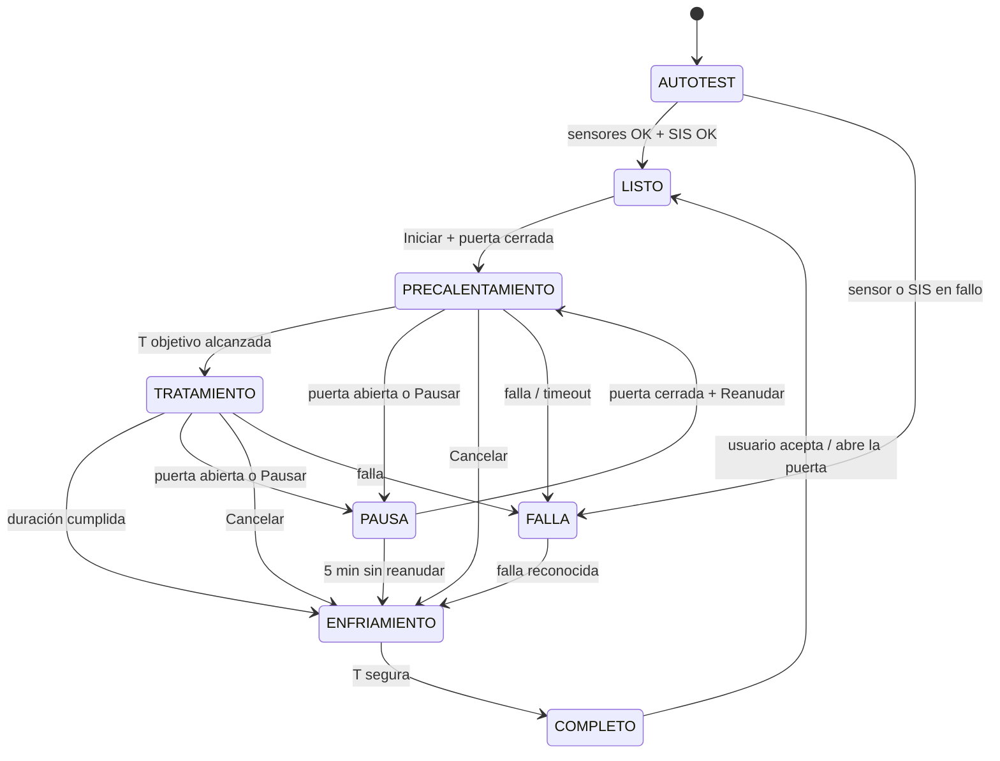

# Máquina de estados del ciclo (Mega)

Resumen. Tabla completa con acciones y transiciones en [PLAN-MAESTRO §8.4](PLAN-MAESTRO.md#84-máquina-de-estados). Los ventiladores los maneja el SIS; la Mega sólo los pide.

| Estado | PTC | Ventiladores | Notas |
|---|---|---|---|
| AUTOTEST | Off | Ventilador PTC on | Lecturas de sensores, enlace con el SIS, puerta válida |
| LISTO | Off | Se piden apagar sólo si está frío (el SIS decide) | Espera al usuario |
| PRECALENTAMIENTO | Control | On | Con tiempo límite; si no alcanza la T, FALLA |
| TRATAMIENTO | Control | On | Cuenta la duración sólo dentro de la banda de T |
| PAUSA | Off | On | Cuenta regresiva de 5 min |
| ENFRIAMIENTO | Off | On | Hasta T segura |
| COMPLETO | Off | On hasta enfriar | Aviso al usuario |
| FALLA | Off | On | Muestra causa; el SIS puede estar disparado |

## Reglas de puerta y pausa

- **Inicio**: sólo desde LISTO, con la puerta cerrada, autotest correcto y SIS en OK.
- **Puerta abierta durante el ciclo**: el SIS inhibe el PTC al instante (sin enclavar) y la Mega pasa a PAUSA.
- **Al cerrar la puerta** el PTC no vuelve solo: hace falta pulsar "Reanudar".
- **Pausa de más de 5 min**: el ciclo se cancela y pasa a ENFRIAMIENTO; hay que volver a elegir el perfil.

## Otras reglas

- Tope global de 120 min (también en el SIS).
- Tras un corte de energía: AUTOTEST → LISTO; nunca retoma un ciclo.
- Si la Mega pierde el enlace con el HMI más de 10 s durante un ciclo: cancela y enfría.

El SIS tiene su propia máquina ([firmware/sis](../firmware/sis/README.md)) y no depende de ésta.
