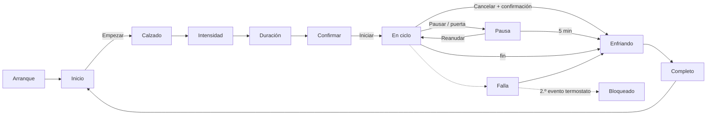

# Plan: interfaz LVGL inicial (prototipo sin el resto del equipo)

## Objetivo

Tener la interfaz completa funcionando en la pantalla ESP32-32E **sin la Mega ni el SIS**. Un **controlador simulado** dentro del propio ESP32 hace de Mega: responde a los botones, recorre los estados del ciclo y permite inyectar puerta abierta, fallas y pérdida de enlace desde el monitor serie.

Cuando la Mega exista, sólo se sustituye el simulador por el enlace UART real; las pantallas no cambian.

**Fuera de alcance en esta etapa:** protocolo UART real, registro en SD, sonido, LED RGB, atenuación de brillo, OTA.

## 1. Pila de software

| Pieza | Elección | Motivo |
|---|---|---|
| Entorno | PlatformIO, `board = esp32dev`, framework Arduino | Mismo entorno que Mega y Nano |
| Plataforma | `espressif32` (Arduino-ESP32 2.0.x), versión **fijada** | Combinación estable con LovyanGFX y LVGL 9 |
| Gráficos | **LVGL 9.x**, versión fijada en `platformio.ini` | Requisito del proyecto |
| Driver de pantalla y táctil | **LovyanGFX** | Soporta ST7789 + XPT2046 en bus SPI compartido, DMA y calibración táctil incluidos |
| Particiones | `huge_app.csv` (≈ 3 MB de app, sin OTA) | LVGL + fuentes con acentos no caben holgadas en la partición por defecto |

Alternativa si LovyanGFX diera problemas: TFT_eSPI (con la misma plataforma fijada).

### Configuración de la placa (para LovyanGFX)

| Parámetro | Valor |
|---|---|
| Bus | SPI HSPI, SCLK 14, MOSI 13, MISO 12, DC 2; escritura a 40 MHz (subir a 80 si es estable) |
| Panel | `Panel_ST7789`, CS 15, RST −1, nativo 240×320, `bus_shared = true` |
| Retroiluminación | `Light_PWM` en IO27 |
| Táctil | `Touch_XPT2046`, CS 33, INT 36, mismo bus, 1–2,5 MHz, `bus_shared = true` |
| Orientación | **Horizontal, 320 × 240** (`setRotation(1)` o `3`, según cómo quede montada la pantalla); el táctil rota con el panel |
| A comprobar en la puesta en marcha | Inversión de color, orden RGB/BGR, cuál de las dos rotaciones horizontales corresponde |

### Configuración de LVGL (sin PSRAM)

- `LV_COLOR_DEPTH 16`. Intercambio de bytes RGB565 en el *flush* (`lv_draw_sw_rgb565_swap`) o en el driver.
- Pantalla LVGL de **320 × 240**. Dos búferes parciales de **320 × 30 px** (≈ 19 KB cada uno) en RAM interna con capacidad DMA, modo `LV_DISPLAY_RENDER_MODE_PARTIAL`.
- `LV_MEM_SIZE` ≈ 64 KB. Cada pantalla se crea al entrar y se borra al salir: nunca todas vivas a la vez.
- Tick con `lv_tick_set_cb(millis)`; `lv_timer_handler()` cada ≈ 5 ms en `loop()`.
- Durante el desarrollo: `LV_USE_SYSMON` (FPS y memoria) y `LV_USE_LOG`.
- Pantallas sin scroll (`LV_OBJ_FLAG_SCROLLABLE` desactivado): el táctil resistivo tiembla y un scroll accidental confunde.

## 2. Criterios de legibilidad y uso con el dedo

La pantalla tiene ≈ 125 px por pulgada, es decir **1 px ≈ 0,2 mm**.

| Elemento | Mínimo | Equivale a |
|---|---|---|
| Cualquier zona táctil | **56 px** de alto y ancho | ≈ 11 mm |
| Botón principal (Iniciar, opciones) | **72 px** de alto | ≈ 15 mm |
| Separación entre botones | **12 px** (16 px entre opciones) | ≈ 2,5–3 mm |
| Margen a los bordes | 8 px | Los bordes del táctil resistivo son menos precisos |
| Texto que el usuario debe leer | **20 px** | |
| Texto de botones | 24 px | |
| Títulos | 28 px | |
| Cifras grandes (tiempo restante) | 48 px | |

Reglas de diseño:

1. **Orientación horizontal** (320 × 240, decisión del usuario). Bajo la cabecera quedan 184 px de alto: las 3 opciones de intensidad y duración van en **3 columnas** (apiladas no alcanzarían los 56 px mínimos).
2. **Un toque por paso**: al elegir una opción se avanza solo al siguiente paso. "Atrás" siempre arriba a la izquierda, en el mismo lugar.
3. **Sin gestos**: nada de deslizar, pulsación larga ni doble toque. Todo es toque simple que se activa al **soltar**, para poder corregir arrastrando fuera del botón.
4. **Confirmación sólo en acciones con consecuencias**: Iniciar (pantalla de resumen) y Cancelar (diálogo "¿Cancelar el tratamiento?").
5. **Respuesta inmediata al toque**: el botón cambia de color al presionarlo, en menos de 100 ms.
6. **No depender sólo del color**: un botón deshabilitado también dice por qué ("Cierra la puerta").
7. **Etiquetas cortas** que quepan en una línea: Cuero, Deportivo, Bota, Sintético; Suave, Media, Intensa; Corta, Media, Larga.
8. **Alto contraste**: fondo claro y texto casi negro; texto blanco sólo sobre colores oscuros. Contraste mínimo 4,5:1 (objetivo 7:1 en textos principales).
9. **Fuente**: Atkinson Hyperlegible (licencia OFL, diseñada para máxima legibilidad), con Montserrat como alternativa.

### Paleta (tokens en `ui/theme`)

| Token | Uso | Color inicial |
|---|---|---|
| `bg` | Fondo | `#FFFFFF` |
| `surface` | Tarjetas, cabecera | `#EEF1F5` |
| `text` | Texto principal | `#111418` |
| `text_muted` | Texto secundario | `#4A5260` |
| `primary` | Opciones, navegación | `#0B4FA8` |
| `go` | Iniciar, Reanudar | `#1B6E35` |
| `danger` | Cancelar, fallas | `#B3261E` |
| `warn_bg` / `warn_text` | Aviso de puerta abierta | `#FFF1C2` / `#5C4300` |
| `disabled_bg` / `disabled_text` | Botón deshabilitado | `#D5D9E0` / `#4E5662` |

Los valores se ajustan en la prueba de usabilidad (fase 6), sobre la pantalla real.

### Fuentes con acentos

Las fuentes incluidas en LVGL sólo traen ASCII: no muestran "á", "ñ", "¿" ni "°". Hay que generarlas con `lv_font_conv` (4 bpp):

| Archivo | Tamaño | Caracteres |
|---|---|---|
| `font_es_20` | 20 px | ASCII + `áéíóúÁÉÍÓÚñÑüÜ¿¡°` + símbolos de LVGL usados |
| `font_es_24` | 24 px | Ídem |
| `font_es_28` | 28 px | Ídem |
| `font_num_48` | 48 px | Sólo `0-9 : % ° C` y espacio |

Rangos para `lv_font_conv`: `0x20-0x7E, 0xA1, 0xB0, 0xBF, 0xC1, 0xC9, 0xCD, 0xD1, 0xD3, 0xDA, 0xDC, 0xE1, 0xE9, 0xED, 0xF1, 0xF3, 0xFA, 0xFC`, más los símbolos de FontAwesome que se usen (flecha atrás, aviso, pausa, play, check, cerrar).

## 3. Pantallas

Medidas en píxeles sobre **320 × 240 (horizontal)**. Cabecera de 56 px con "Atrás" (72 × 56) a la izquierda y título de 24–28 px. Debajo queda un área útil de **304 × 168 px** (márgenes de 8 px).



"Sin comunicación" se superpone a cualquier pantalla. Las pantallas Calzado → Confirmar son estado **local** del HMI; todas las demás las decide el estado que envía la Mega (o el simulador).

### Inicio

```
┌──────────────────────────────────────┐
│ QuitaSicote 3000                     │  cabecera 56
├──────────────────────────────────────┤
│ ● Puerta cerrada                     │  tarjeta de estado 304 × 56, 20 px
│   Equipo listo                       │
│ ┌──────────────────────────────────┐ │
│ │                                  │ │
│ │             EMPEZAR              │ │  304 × 100, primary, 28 px
│ │                                  │ │
│ └──────────────────────────────────┘ │
└──────────────────────────────────────┘
```

### Calzado (cuadrícula 2 × 2)

```
┌──────────────────────────────────────┐
│ ‹ Atrás   Calzado                    │
├──────────────────────────────────────┤
│ ┌────────────────┐ ┌───────────────┐ │
│ │     Cuero      │ │   Deportivo   │ │  cada celda 146 × 78 (≈ 30 × 16 mm)
│ └────────────────┘ └───────────────┘ │  separación 12
│ ┌────────────────┐ ┌───────────────┐ │
│ │      Bota      │ │   Sintético   │ │
│ └────────────────┘ └───────────────┘ │
└──────────────────────────────────────┘
```

### Intensidad / Duración (3 columnas)

```
┌──────────────────────────────────────┐
│ ‹ Atrás   Intensidad                 │
├──────────────────────────────────────┤
│ ┌──────────┐ ┌──────────┐ ┌────────┐ │
│ │          │ │          │ │        │ │
│ │  Suave   │ │  Media   │ │Intensa │ │  cada columna 93 × 168 (≈ 19 × 34 mm)
│ │          │ │          │ │        │ │  separación 12, texto 24 px
│ │          │ │          │ │        │ │
│ └──────────┘ └──────────┘ └────────┘ │
└──────────────────────────────────────┘
```

"Intensa" queda justo en 93 px a 24 px de fuente: comprobarlo en F3 y, si no cabe, bajar a 22 px sólo en estas pantallas.

Al volver con "Atrás", la opción elegida antes aparece marcada (borde grueso + ✓).

### Confirmar

```
┌──────────────────────────────────────┐
│ ‹ Atrás   Confirmar                  │
├──────────────────────────────────────┤
│ Calzado              Deportivo       │  3 filas de 30 px, 20 px
│ Intensidad           Media           │
│ Duración             Larga           │
│ ┌──────────────────────────────────┐ │
│ │             INICIAR              │ │  304 × 72, go
│ └──────────────────────────────────┘ │
└──────────────────────────────────────┘
```

Con la puerta abierta, el mismo botón pasa a gris, queda deshabilitado y su texto cambia a "⚠ Cierra la puerta".

### En ciclo

```
┌──────────────────────────────────────┐
│ Tratando                             │  estado: Calentando / Tratando
├──────────────────────────────────────┤
│   32:15          │ Temperatura 45 °C │  izquierda 150 px: tiempo 48 px
│ ███████░░░░░░░░  │ Humedad     38 %  │  + barra de 16 px
│                  │ Olor        120   │  derecha 142 px: 3 filas de 26 px, 20 px
│ ┌────────────────┐ ┌───────────────┐ │
│ │     PAUSAR     │ │   CANCELAR    │ │  146 × 72 cada uno
│ └────────────────┘ └───────────────┘ │
└──────────────────────────────────────┘
```

En horizontal cabe el VOC ("Olor") como tercera lectura sin apretar el resto. Si se decide no mostrarlo, la fila queda vacía.

### Pausa

```
┌──────────────────────────────────────┐
│ En pausa                             │
├──────────────────────────────────────┤
│ Puerta abierta                       │  24 px
│ Se cancela en 4:12                   │  20 px, cuenta regresiva de 5 min
│                                      │
│ ┌────────────────┐ ┌───────────────┐ │
│ │    REANUDAR    │ │   CANCELAR    │ │  146 × 72 cada uno
│ └────────────────┘ └───────────────┘ │
└──────────────────────────────────────┘
```

Con la puerta abierta, Reanudar queda gris y dice "Cierra la puerta". Si la pausa la pidió el usuario, el texto es "Pausado".

### Diálogo de cancelar

Ventana modal de 288 × 176: "¿Cancelar el tratamiento?" en 24 px (dos líneas), botones **No** (izquierda, neutro) y **Sí, cancelar** (derecha, danger), ambos de 132 × 64.

### Enfriando, Completo, Falla, Bloqueado, Sin comunicación

| Pantalla | Contenido | Botones |
|---|---|---|
| Enfriando | "Enfriando", barra indeterminada, "Puedes abrir la puerta cuando termine" | — |
| Completo | "¡Listo! Retira el calzado" | Aceptar (304 × 72) |
| Falla | Cabecera danger, mensaje en lenguaje llano (20–24 px), código pequeño | Aceptar (solicita reconocer) |
| Termostato activado | "Se detectó sobrecalentamiento. Revisa el ventilador." | Rearmar (con confirmación) |
| Bloqueado | "Equipo bloqueado. Requiere servicio técnico." | — |
| Sin comunicación | Superpuesta: "Sin comunicación con el controlador" | — |

Los textos viven en `ui/strings_es.h`, todos juntos, para corregirlos sin tocar las pantallas.

## 4. Estructura del código

```
firmware/hmi/
├─ platformio.ini
├─ include/
│  └─ lv_conf.h
└─ src/
   ├─ main.cpp                 Inicializa HAL, LVGL, UI y enlace; lazo principal
   ├─ hal/
   │  ├─ lgfx_board.h          Configuración LovyanGFX (ST7789 + XPT2046 + IO27)
   │  ├─ lvgl_port.cpp/.h      Búferes, flush, entrada táctil, tick
   │  └─ touch_calib.cpp/.h    Calibración guardada en NVS (Preferences)
   ├─ model/
   │  └─ hmi_model.h           Lo que la Mega informa: estado, puerta, tiempos, T, HR, VOC, falla
   ├─ link/
   │  ├─ control_link.h        Interfaz: poll(), solicitudes (iniciar, pausar, reanudar, cancelar, reconocer)
   │  └─ mock_link.cpp/.h      Simulador de la Mega (esta etapa)
   └─ ui/
      ├─ theme.cpp/.h          Paleta, estilos, medidas
      ├─ strings_es.h          Todos los textos
      ├─ fonts/                font_es_20/24/28, font_num_48
      ├─ widgets/              big_button, header, status_card, banner, confirm_dialog
      ├─ screens/              boot, home, shoe, intensity, duration, summary,
      │                        cycle, paused, cooling, done, fault, locked, no_link, calib
      └─ ui_controller.cpp/.h  Elige la pantalla según el modelo; estado del asistente de selección
```

Principios:

- **Las pantallas no conocen el enlace**: leen `HmiModel` y llaman a `ControlLink`. Cambiar el simulador por la UART real no toca `ui/`.
- `ui_controller` refresca a 5–10 Hz y sólo actualiza las etiquetas que cambiaron.
- Los ids de calzado, intensidad y duración se tomarán de `firmware/compartido/protocolo/` cuando exista; mientras tanto, en un `enum` local con los mismos valores.

### Simulador (`mock_link`)

Imita a la Mega con una máquina de estados reducida y **tiempo acelerado** (por defecto 1 min simulado = 2 s). Comandos por el monitor serie (115200):

| Comando | Efecto |
|---|---|
| `d` | Abrir / cerrar la puerta |
| `f<n>` | Inyectar la falla `n` |
| `t` | Simular termostato activado; repetirlo lleva a "Bloqueado" |
| `l` | Cortar / restablecer el enlace (→ "Sin comunicación") |
| `x<n>` | Factor de aceleración del tiempo |
| `r` | Reiniciar el simulador |

El monitor serie usa UART0 (USB). El enlace con la Mega irá por UART2 en IO25/IO32 ([pinout](../../docs/pinout/esp32-hmi.md)), así que la depuración por USB sigue disponible después de integrar la Mega.

## 5. Fases

| Fase | Trabajo | Criterio de aceptación |
|---|---|---|
| **F0 Puesta en marcha** | `platformio.ini` con versiones fijadas; LovyanGFX: barras de color, texto, rotación horizontal, retroiluminación; lectura táctil cruda | Colores correctos, texto en horizontal sin desplazamiento ni espejo; el toque coincide con lo dibujado en las 4 esquinas |
| **F1 Calibración táctil** | Rutina de 4 puntos; guardar en NVS; se lanza en el primer arranque o manteniendo el dedo en la pantalla al encender 3 s | Error ≤ 4 px en esquinas y centro, con dedo y con stylus |
| **F2 LVGL mínimo** | Port: búferes, flush, táctil, tick; un botón que cambia una etiqueta; SYSMON activo | Sin parpadeo ni artefactos; ≥ 100 KB de heap libre |
| **F3 Tema, fuentes y componentes** | Fuentes con acentos, paleta, `big_button`, cabecera, aviso, diálogo; una pantalla de muestra con todos | Se leen "Duración", "Sintético", "¿Cancelar…?", "45 °C"; todas las zonas táctiles ≥ 56 px |
| **F4 Modelo y simulador** | `HmiModel`, `ControlLink`, `mock_link` con comandos serie | Los comandos cambian el estado y se ven en el log serie |
| **F5 Flujo de selección** | Inicio → Calzado → Intensidad → Duración → Confirmar, con Atrás y puerta abierta | De Inicio a "Iniciar" en 5 toques; con `d` (puerta abierta) Iniciar queda deshabilitado con su motivo |
| **F6 Pantallas del ciclo** | En ciclo, Pausa (cuenta de 5 min), diálogo de cancelar, Enfriando, Completo, Falla, Termostato, Bloqueado, Sin comunicación | Cada cambio de estado del simulador se refleja en < 300 ms; ninguna pantalla queda "pegada" |
| **F7 Prueba de usabilidad** | 3–5 personas, con dedo y con stylus: iniciar un ciclo, pausarlo, reanudarlo, cancelarlo; leer el tiempo restante a 50 cm | Ningún toque erróneo en las tareas principales; ajustes de tamaño/contraste aplicados |

## 6. Riesgos

| Riesgo | Mitigación |
|---|---|
| Ajustes del ST7789P3 (inversión, orden de color, desplazamiento) distintos a los de un ST7789 genérico | Resolverlo en F0 con barras de color antes de usar LVGL |
| Incompatibilidades de versiones (Arduino-ESP32, LVGL, LovyanGFX) | Fijar las tres versiones en F0 y no actualizarlas durante el prototipo |
| Poca RAM (sin PSRAM) | Búferes parciales, pantallas creadas y borradas bajo demanda, vigilar con SYSMON |
| Táctil resistivo impreciso en bordes y con poca presión | Calibración, margen de 8 px, zonas grandes, activación al soltar |
| Fuentes pesadas en flash | Sólo los tamaños listados; la de 48 px sólo con cifras |

## 7. Después del prototipo

1. Sustituir `mock_link` por `uart_link` sobre UART2 (IO25/IO32, 57600) con el protocolo de `compartido/protocolo/` ([PLAN-MAESTRO §6](../../docs/PLAN-MAESTRO.md#6-firmware-común)).
2. Decidir el registro en SD, el sonido de confirmación y la atenuación de brillo en reposo.
